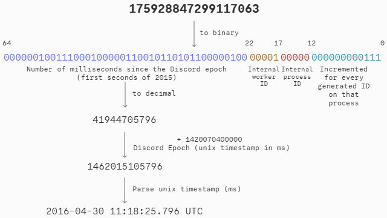

# [API 参考文档](https://discord.com/developers/docs/reference#api-reference)

Discord 的 API 基于两个核心层：一是用于常规操作的 HTTPS/REST API，二是基于持久安全 WebSocket 的连接，用于发送和订阅实时事件。Discord API 最常见的用途是通过 [OAuth2](https://oauth.net/2/) API 提供第三方服务或平台访问权限。

###### [基础 URL](https://discord.com/developers/docs/reference#api-reference-base-url)

```
https://discord.com/api
```

## [API 版本控制](https://discord.com/developers/docs/reference#api-versioning)

部分 API 和网关版本现已失效，并在下表中标记为“已停用”，以供存档参考。尝试使用这些版本将导致请求失败，并返回 400 错误请求。

Discord 提供了多个 API 版本[](https://c.tenor.com/BuZl66EegkgAAAAC/westworld-dolores.gif)。您应在请求路径中包含版本号以指定使用的版本，例如：`https://discord.com/api/v{版本号}`

若省略版本号，请求将被路由至当前默认版本（如下方标记所示）。

您可在此处查阅最新 API 版本的[变更日志](https://discord.com/developers/docs/change-log)。

###### [API 版本](https://discord.com/developers/docs/reference#api-versioning-api-versions)

<table><thead><tr><th>版本</th><th>状态</th><th>默认</th></tr></thead><tbody><tr><td>10</td><td>可用</td><td></td></tr><tr><td>9</td><td>可用</td><td></td></tr><tr><td>8</td><td>已弃用</td><td></td></tr><tr><td>7</td><td>已弃用</td><td></td></tr><tr><td>6</td><td>已弃用</td><td>✓</td></tr><tr><td>5</td><td>已停用</td><td></td></tr><tr><td>4</td><td>已停用</td><td></td></tr><tr><td>3</td><td>已停用</td><td></td></tr></tbody></table>

## [错误消息](https://discord.com/developers/docs/reference#error-messages)

自 API v8 起，我们优化了表单错误响应的格式。响应中将明确指出包含错误的 JSON 键、错误代码以及易于理解的错误信息。由于我们会持续新增错误消息，完整的错误列表难以实现，且极易过时。以下为部分示例：

###### [数组错误](https://discord.com/developers/docs/reference#error-messages-array-error)

```
  "code": 50035,
  "errors": {
    "activities": {
      "0": {
        "platform": {
          "_errors": [
            {
              "code": "BASE_TYPE_CHOICES",
              "message": "Value must be one of ('desktop', 'android', 'ios')."
            }
          ]
        },
        "type": {
          "_errors": [
            {
              "code": "BASE_TYPE_CHOICES",
              "message": "Value must be one of (0, 1, 2, 3, 4, 5)."
            }
          ]
        }
      }
    }
  },
  "message": "Invalid Form Body"
```

###### [对象错误](https://discord.com/developers/docs/reference#error-messages-object-error)

```
{
  "code": 50035,
  "errors": {
    "access_token": {
      "_errors": [
        {
          "code": "BASE_TYPE_REQUIRED",
          "message": "此字段为必填项"
        }
      ]
    }
  },
  "message": "Invalid Form Body"
}
```

###### [请求错误](https://discord.com/developers/docs/reference#error-messages-request-error)

```
{
  "code": 50035,
  "message": "Invalid Form Body",
  "errors": {
    "_errors": [
      {
        "code": "APPLICATION_COMMAND_TOO_LARGE",
        "message": "Command exceeds maximum size (8000)"
      }
    ]
  }
}
```

## [身份验证](https://discord.com/developers/docs/reference#authentication)

Discord API 的身份验证可通过以下两种方式之一完成：

1. 使用应用设置中 Bot 页面提供的机器人令牌。有关机器人的更多信息，请参见[机器人与用户账户](https://discord.com/developers/docs/topics/oauth2#bot-vs-user-accounts)。

2. 使用通过 [OAuth2 API](https://discord.com/developers/docs/topics/oauth2#oauth2) 获取的 OAuth2 持有者令牌。

对于所有身份验证类型，均需使用 `Authorization` HTTP 标头，格式为：`Authorization: TOKEN_TYPE TOKEN`。

###### [机器人令牌授权标头示例](https://discord.com/developers/docs/reference#authentication-example-bot-token-authorization-header)

```
授权：Bot MTk4NjIyNDgzNDcxOTI1MjQ4.Cl2FMQ.ZnCjm1XVW7vRze4b7Cq4se7kKWs
```

###### [示例承载令牌授权头](https://discord.com/developers/docs/reference#authentication-example-bearer-token-authorization-header)

```
授权：Bearer CZhtkLDpNYXgPH9Ml6shqh2OwykChw
```

## [加密](https://discord.com/developers/docs/reference#encryption)

Discord API 中的所有 HTTP 层服务和协议（例如 HTTP、WebSocket）均采用 TLS 1.2 进行通信。

## [雪花ID](https://discord.com/developers/docs/reference#snowflakes)

Discord 采用 Twitter 的[雪花](https://github.com/twitter-archive/snowflake/tree/snowflake-2010)格式作为唯一可识别描述符（ID）。

这些 ID 在整个 Discord 平台中保证唯一，除非在极少数特殊场景下，子对象会共享其父对象的 ID。由于雪花 ID 最大可达 64 位（例如 uint64），在 HTTP API 中始终以字符串形式返回，以避免某些语言中的整数溢出问题。如需了解更多关于网关编码的信息，请参阅[网关 ETF/JSON](https://discord.com/developers/docs/events/gateway#encoding-and-compression)。

###### [二进制分解雪花ID](https://discord.com/developers/docs/reference#snowflakes-snowflake-id-broken-down-in-binary)

```
111111111111111111111111111111111111111111 11111 11111 111111111111
64                                         22    17    12          0
```

###### [雪花ID格式结构（从左到右）](https://discord.com/developers/docs/reference#snowflakes-snowflake-id-format-structure-left-to-right)

<table><thead><tr><th>字段</th><th>位域</th><th>位数</th><th>描述</th><th>提取方式</th></tr></thead><tbody><tr><td>时间戳</td><td>63至22</td><td>42位</td><td>自 Discord 纪元（即2015年第一秒，对应1420070400000毫秒）以来的毫秒数</td><td><code> (雪花ID >> 22) + 1420070400000</code></td></tr><tr><td>内部工作器ID</td><td>21至17</td><td>5位</td><td></td><td><code> (雪花ID & 0x3E0000) >> 17</code></td></tr><tr><td>内部进程ID</td><td>16至12</td><td>5位</td><td></td><td><code> (雪花ID & 0x1F000) >> 12</code></td></tr><tr><td>增量值</td><td>11至0</td><td>12位</td><td>在该进程上生成的每个 ID 都会递增此数值</td><td><code>雪花ID & 0xFFF</code></td></tr></tbody></table>

### [将雪花ID转换为日期时间](https://discord.com/developers/docs/reference#convert-snowflake-to-datetime)



### [分页中的雪花ID](https://discord.com/developers/docs/reference#snowflake-ids-in-pagination)

我们通常在众多 API 路由中使用雪花 ID 进行分页。采用的标准分页范式是：您可以通过结合使用 `before` 和 `after` 参数与 `limit` 参数，获取所需的结果页面。具体细节请参考相关端点的文档。

值得注意的是，雪花 ID 本质上是带有时间戳的数字，因此当处理需要从时间起点（在 Discord 纪元中，也可使用 `0`）或特定时间之前/之后获取结果的分页时，您可以为该时间生成一个雪花 ID。

###### [从时间戳生成雪花ID示例](https://discord.com/developers/docs/reference#snowflake-ids-in-pagination-generating-a-snowflake-id-from-a-timestamp-example)

```
(时间戳_毫秒 - DISCORD_EPOCH) << 22
```

## [ID序列化](https://discord.com/developers/docs/reference#id-serialization)

在某些情况下，我们的API和网关可能会以非预期格式返回ID。Discord在内部将ID存储为整数雪花值。当我们把ID序列化为JSON时，会将`bigints`转换为字符串。由于所有Discord ID均为雪花值，您应始终预期收到字符串格式。

然而，在某些情况下，向我们的API传递数据时可能会返回序列化为整数的ID；这种情况发生在您向API或网关发送的`id`字段值不符合`bigint`大小要求时。例如，当从网关请求`GUILD_MEMBERS_CHUNK`时：

```
// 发送
{
  op: 8,
  d: {
    guild_id: '308994132968210433',
    user_ids: [ '123123' ]
  }
}

// 接收
{
  t: 'GUILD_MEMBERS_CHUNK',
  s: 3,
  op: 0,
  d: {
    not_found: [ 123123 ],
    members: [],
    guild_id: '308994132968210433'
  }
}
```

您可以看到，在此情况下发送的`user_id`并非`bigint`；因此，当Discord将其序列化回JSON时，它不会被转换为字符串。这种情况绝不会发生在来自Discord的ID上。但如果您在请求中发送了格式错误的数据，则可能发生此类情况。

## [ISO8601日期/时间](https://discord.com/developers/docs/reference#iso8601-datetime)

Discord在模型中返回的大多数日期/时间均采用[ISO8601格式](https://www.loc.gov/standards/datetime/iso-tc154-wg5_n0038_iso_wd_8601-1_2016-02-16.pdf)。在本文档的表格中，此格式被标记为`ISO8601`类型。

## [可空和可选资源字段](https://discord.com/developers/docs/reference#nullable-and-optional-resource-fields)

可能包含`null`值的资源字段的类型前缀带有问号；而可选的资源字段的名称后缀则带有问号。

###### [可空和可选字段示例](https://discord.com/developers/docs/reference#nullable-and-optional-resource-fields-example-nullable-and-optional-fields)

<table><thead><tr><th>Field</th><th>Type</th></tr></thead><tbody><tr><td>optional_field ? 

</td><td>string</td></tr><tr><td>nullable_field</td><td>?string</td></tr><tr><td>optional_and_nullable_field ? 

</td><td>？string</td></tr></tbody></table>

## [一致性](https://discord.com/developers/docs/reference#consistency)

Discord的运营规模使得完全一致性无法实现。因此，我们的API及服务间的许多操作均采用[最终一致性](https://en.wikipedia.org/wiki/Eventual_consistency)。

基于此，客户端操作无法被序列化，且可能以任意顺序执行（如果确实执行的话）。

除上述限制外，Discord中的事件可能：

* 永远不会发送至客户端
* 恰好发送一次至客户端
* 每个客户端最多发送N次

客户端应尽可能以幂等方式处理来自API的事件和结果。

## [HTTP API](https://discord.com/developers/docs/reference#http-api)

### [用户代理](https://discord.com/developers/docs/reference#user-agent)

使用HTTP API的客户端必须提供有效的[用户代理](https://www.rfc-editor.org/rfc/rfc9110.html#section-10.1.5)，并按照以下格式指定客户端库和版本信息：

###### [用户代理示例](https://discord.com/developers/docs/reference#user-agent-user-agent-example)

```
User-Agent: DiscordBot ($url , $versionNumber)
```

客户端可根据需要在此字符串末尾附加更多信息与元数据。

未指定有效用户代理的客户端请求可能会被拦截，并返回[Cloudflare错误](https://support.cloudflare.com/hc/en-us/articles/360029779472-Troubleshooting-Cloudflare-1XXX-errors)。

### [内容类型](https://discord.com/developers/docs/reference#content-type)

使用HTTP API的客户端必须提供有效的`Content-Type`标头，可选值为`application/json`、`application/x-www-form-urlencoded`或`multipart/form-data`，除非另有说明。否则将导致`50035`“无效表单体”错误。

### [速率限制](https://discord.com/developers/docs/reference#rate-limiting)

HTTP API依据[RFC 6585](https://tools.ietf.org/html/rfc6585#section-4)实施限制和防止过多请求的机制。

频繁触及并忽视速率限制的API用户将被撤销其API密钥，并遭到平台封禁。有关请求速率限制的更多信息，请参阅[速率限制](https://discord.com/developers/docs/topics/rate-limits#rate-limits)部分。

### [布尔查询字符串](https://discord.com/developers/docs/reference#boolean-query-strings)

API 中部分端点支持接收布尔值作为查询字符串参数。尽管查询字符串参数尚未形成统一的布尔值表示标准，Discord 采用 `True`、`true` 或 `1` 表示“真”，`False`、`false` 或 `0` 表示“假”。

## [网关（WebSocket）API](https://discord.com/developers/docs/reference#gateway-websocket-api)

Discord 的网关 API 用于在客户端与服务器之间维持持久、有状态的 WebSocket 连接。借助这些连接，客户端能够收发实时事件，用以追踪和更新本地状态。网关 API 采用符合 [RFC 6455](https://tools.ietf.org/html/rfc6455) 规范的安全 WebSocket 连接。

如需了解如何建立网关连接，请参阅[网关 API](https://discord.com/developers/docs/events/gateway#connections) 章节。

## [消息格式化](https://discord.com/developers/docs/reference#message-formatting)

Discord 使用 Markdown 的一个子集渲染客户端消息内容，并在此基础上扩展了自定义功能，例如提及用户和频道等。这些功能采用以下格式：

###### [格式](https://discord.com/developers/docs/reference#message-formatting-formats)

<table><thead><tr><th>类型</th><th>结构</th><th>示例</th></tr></thead><tbody><tr><td>用户</td><td><code>&lt;@用户ID&gt;</code></td><td><code>&lt;@80351110224678912&gt;</code></td></tr><tr><td>用户*</td><td><code>&lt;@!用户ID&gt;</code></td><td><code>&lt;@!80351110224678912&gt;</code></td></tr><tr><td>频道</td><td><code>&lt;#频道ID&gt;</code></td><td><code>&lt;#103735883630395392&gt;</code></td></tr><tr><td>角色</td><td><code>&lt;@&角色ID&gt;</code></td><td><code>&lt;@&165511591545143296&gt;</code></td></tr><tr><td>斜杠命令**</td><td><code>&lt;/名称:命令ID&gt;</code></td><td><code>&lt;/airhorn:816437322781949972&gt;</code></td></tr><tr><td>标准表情符号</td><td>Unicode 字符</td><td>🦶</td></tr><tr><td>自定义表情符号</td><td><code>&lt;:名称:ID&gt;</code></td><td><code>&lt;:mmLol:216154654256398347&gt;</code></td></tr><tr><td>自定义表情符号（动态）</td><td><code>&lt;a:名称:ID&gt;</code></td><td><code>&lt;a:b1nzy:392938283556143104&gt;</code></td></tr><tr><td>Unix 时间戳***</td><td><code>&lt;t:时间戳&gt;</code></td><td><code>&lt;t:1618953630&gt;</code></td></tr><tr><td>Unix 时间戳（样式化）***</td><td><code>&lt;t:时间戳:样式&gt;</code></td><td><code>&lt;t:1618953630:d&gt;</code></td></tr><tr><td>服务器导航</td><td><code>&lt;id:类型&gt;</code></td><td><code>&lt;id:customize&gt;</code></td></tr><tr><td>邮箱****</td><td><code>&lt;用户名@域名&gt;</code></td><td><code>&lt;nelly@discord.com&gt;</code></td></tr><tr><td>电话号码****</td><td><code>&lt;+电话号码&gt;</code></td><td><code>&lt;+1 (555) 123 4567&gt;</code></td></tr></tbody></table>

使用用户、角色或频道的 Markdown 语法通常会触发对目标的提及效果，但可在创建消息时通过 [`allowed_mentions`](https://discord.com/developers/docs/resources/message#message-object) 参数进行抑制。

目前，标准表情符号在桌面端与 Android 端使用 [Twemoji](https://github.com/jdecked/twemoji) 渲染，iOS 端则使用苹果原生表情符号。

`*` : 带感叹号的用户提及标记现已弃用，应与其他用户提及采用相同的处理方式。

`**` : 子命令和子命令组可分别通过 `</名称 子命令:ID>` 和 `</名称 子命令组 子命令:ID>` 进行引用。

`***` : 时间戳以秒为单位表示，并会根据用户的时区与本地化设置显示对应时间。

`****` : 电子邮件和电话号码标记分别采用 `mailto:` 和 `tel:` URI 方案，可选择性地添加前缀（例如 `<mailto:nelly@discord.com>`）。

电子邮件标记支持标题，其值需进行 [URL 编码](https://en.wikipedia.org/wiki/Percent-encoding)（例如 `<nelly@discord.com?subject=消息%20标题&body=消息%20内容>`）。

###### [时间戳样式](https://discord.com/developers/docs/reference#message-formatting-timestamp-styles)

<table><thead><tr><th>样式</th><th>示例输出</th><th>描述</th></tr></thead><tbody><tr><td>t</td><td>16:20</td><td>短时间</td></tr><tr><td>T</td><td>16:20:30</td><td>长时间</td></tr><tr><td>d</td><td>20/04/2021</td><td>短日期</td></tr><tr><td>D</td><td>2021年4月20日</td><td>长日期</td></tr><tr><td>f *</td><td>2021年4月20日 16:20</td><td>短日期/时间</td></tr><tr><td>F</td><td>2021年4月20日星期二 16:20</td><td>长日期/时间</td></tr><tr><td>R</td><td>2个月前</td><td>相对时间</td></tr></tbody></table>

`*` : 此为未指定样式时所采用的默认样式。

###### [服务器导航类型](https://discord.com/developers/docs/reference#message-formatting-guild-navigation-types)

服务器导航类型用于链接至当前服务器内的对应资源。

<table><thead><tr><th>类型</th><th>描述</th></tr></thead><tbody><tr><td>customize</td><td><span class="italics-1aHcnm">自定义</span>选项卡，包含服务器的<a class="link-3m0lUT" href="https://discord.com/developers/docs/resources/guild#guild-onboarding-object" data-discover="true">引导提示</a></td></tr><tr><td>browse</td><td><span class="italics-1aHcnm">浏览频道</span>选项卡</td></tr><tr><td>guide</td><td><a class="anchor-1MIwyf link-3m0lUT" href="https://support.discord.com/hc/en-us/articles/13497665141655" rel="noreferrer noopener" target="_blank" role="button" tabindex="0">服务器指南</a></td></tr><tr><td>linked-roles</td><td><a class="anchor-1MIwyf link-3m0lUT" href="https://support.discord.com/hc/en-us/articles/10388356626711" rel="noreferrer noopener" target="_blank" role="button" tabindex="0">链接角色</a></td></tr><tr><td>linked-roles<div></div></td><td><span class="italics-1aHcnm">链接角色</span>连接</td></tr></tbody></table>

## [图像格式化](https://discord.com/developers/docs/reference#image-formatting)

###### [图像基础 URL](https://discord.com/developers/docs/reference#image-formatting-image-base-url)

```
https://cdn.discordapp.com/
```

Discord 使用 ID 和哈希值在客户端渲染图像，这些哈希可通过多种 API 请求获取，如 [获取用户](https://discord.com/developers/docs/resources/user#get-user)。

以下为 Discord 中图像的格式、大小限制及 CDN 端点信息。可通过更改 URL 末尾的 [扩展名](https://discord.com/developers/docs/reference#image-formatting-image-formats) 调整返回格式，通过在 URL 后附加 `?size=期望尺寸` 查询字符串调整返回尺寸。图像尺寸可为 16 至 4096 之间任意 2 的幂。

###### [图像格式](https://discord.com/developers/docs/reference#image-formatting-image-formats)

<table><thead><tr><th>格式名称</th><th>文件扩展名</th></tr></thead><tbody><tr><td>JPEG</td><td>.jpg、.jpeg</td></tr><tr><td>PNG</td><td>.png</td></tr><tr><td>WebP</td><td>.webp</td></tr><tr><td>GIF</td><td>.gif</td></tr><tr><td>AVIF</td><td>.avif</td></tr><tr><td>Lottie</td><td>.json</td></tr></tbody></table>

###### [CDN 端点 ](https://discord.com/developers/docs/reference#image-formatting-cdn-endpoints)

<table>
   <thead>
       <tr>
           <th>类型</th>
           <th>路径</th>
           <th>支持格式</th>
       </tr>
   </thead>
   <tbody>
       <tr>
           <td>自定义表情</td>
           <td>emojis/<a class="link-3m0lUT" href="https://discord.com/developers/docs/resources/emoji#emoji-object" data-discover="true">emoji_id</a>.png *****</td>
           <td>PNG、JPEG、WebP、GIF、AVIF</td>
       </tr>
       <tr>
           <td>服务器图标</td>
           <td>icons/<a class="link-3m0lUT" href="https://discord.com/developers/docs/resources/guild#guild-object" data-discover="true">guild_id</a>/<a class="link-3m0lUT" href="https://discord.com/developers/docs/resources/guild#guild-object" data-discover="true">guild_icon</a>.png *</td>
           <td>PNG、JPEG、WebP、GIF</td>
       </tr>
       <tr>
           <td>服务器欢迎背景</td>
           <td>splashes/<a class="link-3m0lUT" href="https://discord.com/developers/docs/resources/guild#guild-object" data-discover="true">guild_id</a>/<a class="link-3m0lUT" href="https://discord.com/developers/docs/resources/guild#guild-object" data-discover="true">guild_splash</a>.png</td>
           <td>PNG、JPEG、WebP</td>
       </tr>
       <tr>
           <td>服务器发现页背景</td>
           <td>discovery-splashes/<a class="link-3m0lUT" href="https://discord.com/developers/docs/resources/guild#guild-object" data-discover="true">guild_id</a>/<a class="link-3m0lUT" href="https://discord.com/developers/docs/resources/guild#guild-object" data-discover="true">guild_discovery_splash</a>.png</td>
           <td>PNG、JPEG、WebP</td>
       </tr>
       <tr>
           <td>服务器横幅</td>
           <td>banners/<a class="link-3m0lUT" href="https://discord.com/developers/docs/resources/guild#guild-object" data-discover="true">guild_id</a>/<a class="link-3m0lUT" href="https://discord.com/developers/docs/resources/guild#guild-object" data-discover="true">guild_banner</a>.png *</td>
           <td>PNG、JPEG、WebP、GIF</td>
       </tr>
       <tr>
           <td>用户横幅</td>
           <td>banners/<a class="link-3m0lUT" href="https://discord.com/developers/docs/resources/user#user-object" data-discover="true">user_id</a>/<a class="link-3m0lUT" href="https://discord.com/developers/docs/resources/user#user-object" data-discover="true">user_banner</a>.png *</td>
           <td>PNG、JPEG、WebP、GIF</td>
       </tr>
       <tr>
           <td>默认用户头像</td>
           <td>embed/avatars/<a class="link-3m0lUT" href="https://discord.com/developers/docs/resources/user#user-object" data-discover="true">index</a>.png ** ***</td>
           <td>PNG</td>
       </tr>
       <tr>
           <td>用户头像</td>
           <td>avatars/<a class="link-3m0lUT" href="https://discord.com/developers/docs/resources/user#user-object" data-discover="true">user_id</a>/<a class="link-3m0lUT" href="https://discord.com/developers/docs/resources/user#user-object" data-discover="true">user_avatar</a>.png *</td>
           <td>PNG、JPEG、WebP、GIF</td>
       </tr>
       <tr>
           <td>服务器成员头像</td>
           <td>guilds/<a class="link-3m0lUT" href="https://discord.com/developers/docs/resources/guild#guild-object" data-discover="true">guild_id</a>/users/<a class="link-3m0lUT" href="https://discord.com/developers/docs/resources/user#user-object" data-discover="true">user_id</a>/avatars/<a class="link-3m0lUT" href="https://discord.com/developers/docs/resources/guild#guild-member-object" data-discover="true">member_avatar</a>.png *</td>
           <td>PNG、JPEG、WebP、GIF</td>
       </tr>
       <tr>
           <td>头像装饰</td>
           <td>avatar-decoration-presets/<a class="link-3m0lUT" href="https://discord.com/developers/docs/resources/user#avatar-decoration-data-object" data-discover="true">avatar_decoration_data_asset</a>.png</td>
           <td>PNG</td>
       </tr>
       <tr>
           <td>应用图标</td>
           <td>app-icons/<a class="link-3m0lUT" href="https://discord.com/developers/docs/resources/application#application-object" data-discover="true">application_id</a>/<a class="link-3m0lUT" href="https://discord.com/developers/docs/resources/application#application-object" data-discover="true">icon</a>.png</td>
           <td>PNG、JPEG、WebP</td>
       </tr>
       <tr>
           <td>应用封面</td>
           <td>app-icons/<a class="link-3m0lUT" href="https://discord.com/developers/docs/resources/application#application-object" data-discover="true">application_id</a>/<a class="link-3m0lUT" href="https://discord.com/developers/docs/resources/application#application-object" data-discover="true">cover_image</a>.png</td>
           <td>PNG、JPEG、WebP</td>
       </tr>
       <tr>
           <td>应用资源</td>
           <td>app-assets/<a class="link-3m0lUT" href="https://discord.com/developers/docs/resources/application#application-object" data-discover="true">application_id</a>/<a class="link-3m0lUT" href="https://discord.com/developers/docs/events/gateway-events#activity-object-activity-assets" data-discover="true">asset_id</a>.png</td>
           <td>PNG、JPEG、WebP</td>
       </tr>
       <tr>
           <td>成就图标</td>
           <td>app-assets/<a class="link-3m0lUT" href="https://discord.com/developers/docs/resources/application#application-object" data-discover="true">application_id</a>/achievements/<a class="anchor-1MIwyf link-3m0lUT" href="https://github.com/discord/discord-api-docs/blob/legacy-gamesdk/docs/game_sdk/Achievements.md#user-achievement-struct" rel="noreferrer noopener" target="_blank" role="button" tabindex="0">achievement_id</a>/icons/<a class="anchor-1MIwyf link-3m0lUT" href="https://github.com/discord/discord-api-docs/blob/legacy-gamesdk/docs/game_sdk/Achievements.md#user-achievement-struct" rel="noreferrer noopener" target="_blank" role="button" tabindex="0">icon_hash</a>.png</td>
           <td>PNG、JPEG、WebP</td>
       </tr>
       <tr>
           <td>商店页面资源</td>
           <td>app-assets/<a class="link-3m0lUT" href="https://discord.com/developers/docs/resources/application#application-object" data-discover="true">application_id</a>/store/asset_id</td>
           <td>PNG、JPEG、WebP</td>
       </tr>
       <tr>
           <td>贴纸包横幅</td>
           <td>app-assets/710982414301790216/store/<a class="link-3m0lUT" href="https://discord.com/developers/docs/resources/sticker#sticker-pack-object" data-discover="true">sticker_pack_banner_asset_id</a>.png</td>
           <td>PNG、JPEG、WebP</td>
       </tr>
       <tr>
           <td>团队图标</td>
           <td>team-icons/<a class="link-3m0lUT" href="https://discord.com/developers/docs/topics/teams#data-models-team-object" data-discover="true">team_id</a>/<a class="link-3m0lUT" href="https://discord.com/developers/docs/topics/teams#data-models-team-object" data-discover="true">team_icon</a>.png</td>
           <td>PNG、JPEG、WebP</td>
       </tr>
       <tr>
           <td>贴纸</td>
           <td>stickers/<a class="link-3m0lUT" href="https://discord.com/developers/docs/resources/sticker#sticker-object" data-discover="true">sticker_id</a>.png *** ****</td>
           <td>PNG、Lottie、GIF</td>
       </tr>
       <tr>
           <td>角色图标</td>
           <td>role-icons/<a class="link-3m0lUT" href="https://discord.com/developers/docs/topics/permissions#role-object" data-discover="true">role_id</a>/<a class="link-3m0lUT" href="https://discord.com/developers/docs/topics/permissions#role-object" data-discover="true">role_icon</a>.png</td>
           <td>PNG、JPEG、WebP</td>
       </tr>
       <tr>
           <td>服务器计划活动封面</td>
           <td>guild-events/<a class="link-3m0lUT" href="https://discord.com/developers/docs/resources/guild-scheduled-event#guild-scheduled-event-object" data-discover="true">scheduled_event_id</a>/<a class="link-3m0lUT" href="https://discord.com/developers/docs/resources/guild-scheduled-event#guild-scheduled-event-object" data-discover="true">scheduled_event_cover_image</a>.png</td>
           <td>PNG、JPEG、WebP</td>
       </tr>
       <tr>
           <td>服务器成员横幅</td>
           <td>guilds/<a class="link-3m0lUT" href="https://discord.com/developers/docs/resources/guild#guild-object" data-discover="true">guild_id</a>/users/<a class="link-3m0lUT" href="https://discord.com/developers/docs/resources/user#user-object" data-discover="true">user_id</a>/banners/<a class="link-3m0lUT" href="https://discord.com/developers/docs/resources/guild#guild-member-object" data-discover="true">member_banner</a>.png *</td>
           <td>PNG、JPEG、WebP、GIF</td>
       </tr>
       <tr>
           <td>服务器标签徽章</td>
           <td>guild-tag-badges/<a class="link-3m0lUT" href="https://discord.com/developers/docs/resources/guild#guild-object" data-discover="true">guild_id</a>/<a class="link-3m0lUT" href="https://discord.com/developers/docs/resources/user#user-object-user-primary-guild" data-discover="true">badge_hash</a>.png</td>
           <td>PNG、JPEG、WebP</td>
       </tr>
   </tbody>
</table>

`*` : 对于支持GIF格式的端点，若该资源提供GIF版本，其哈希值将以`a_`开头。您还可以通过添加`?animated=true`查询参数来获取动画WebP格式的图像。（示例：`a_1269e74af4df7417b13759eae50c83dc`）

`**` : 在默认用户头像端点中，`index`的取值取决于用户是否已[迁移至新的用户名系统](https://discord.com/developers/docs/change-log#unique-usernames-on-discord)。

对于采用新用户名系统的用户，`index`的计算方式为 `(user_id >> 22) % 6`。

对于仍使用旧用户名系统的用户，`index`则为 `discriminator % 5`。

`***` : 对于默认用户头像及贴纸端点，所返回的图像尺寸是固定的，系统将忽略“size”查询参数。

`****` : 在贴纸端点中，贴纸的格式取决于其[`format_type`](https://discord.com/developers/docs/resources/sticker#sticker-object)：若为`PNG`或`APNG`，则以PNG格式提供；若为`GIF`，则提供GIF格式；若为`LOTTIE`，则提供[Lottie](https://airbnb.io/lottie/#/)格式。

`*****` : 对于自定义表情，我们强烈建议以WebP格式请求，以实现最佳性能和兼容性。表情可上传为JPEG、PNG、GIF、WebP和AVIF格式。请注意，WebP和AVIF格式需以WebP格式请求，因其不易转换为其他格式。Discord客户端在应用中显示的所有表情均使用WebP格式。更多信息请参见[表情资源](https://discord.com/developers/docs/resources/emoji)页面。

贴纸GIF不使用CDN基础URL，其访问地址为：`https://media.discordapp.net/stickers/<sticker_id>.gif`

## [图像数据](https://discord.com/developers/docs/reference#image-data)

图像数据采用[数据URI方案](https://en.wikipedia.org/wiki/Data_URI_scheme)，支持JPG、GIF和PNG格式。数据URI的示例格式如下：

```
data:image/jpeg;base64,BASE64_ENCODED_JPEG_IMAGE_DATA
```

请务必使用与所提供图像数据相匹配的正确内容类型（如`image/jpeg`、`image/png`、`image/gif`）。

### [签名附件CDN URL](https://discord.com/developers/docs/reference#signed-attachment-cdn-urls)

上传至Discord CDN的附件（例如用户或机器人上传的图像）具有带预设过期时间的签名URL。Discord会自动刷新客户端内显示的附件CDN URL，因此当您的应用接收到带有签名URL的有效负载（例如在[获取消息](https://discord.com/developers/docs/resources/message#get-channel-message)时），该URL将是有效的。

当将CDN URL传递至API字段时（例如[嵌入图像对象中的`url`](https://discord.com/developers/docs/resources/message#embed-object-embed-image-structure)或[Webhook的`avatar_url`](https://discord.com/developers/docs/resources/webhook#execute-webhook-jsonform-params)），您的应用可直接传递CDN URL而不带任何参数，Discord将自动渲染并刷新该URL。

上述[标准CDN端点](https://discord.com/developers/docs/reference#image-formatting-cdn-endpoints)未经签名，因此不会过期。

###### [附件CDN URL示例](https://discord.com/developers/docs/reference#signed-attachment-cdn-urls-example-attachment-cdn-url)

```
https://cdn.discordapp.com/attachments/1012345678900020080/1234567891233211234/my_image.png?ex=65d903de&is=65c68ede&hm=2481f30dd67f503f54d020ae3b5533b9987fae4e55f2b4e3926e08a3fa3ee24f&
```

###### [附件CDN URL参数](https://discord.com/developers/docs/reference#signed-attachment-cdn-urls-attachment-cdn-url-parameters)

<table><thead><tr><th>参数</th><th>描述</th></tr></thead><tbody><tr><td>ex</td><td>十六进制时间戳，表示附件CDN URL的过期时间</td></tr><tr><td>is</td><td>十六进制时间戳，表示URL的签发时间</td></tr><tr><td>hm</td><td>唯一签名，在URL过期前始终保持有效</td></tr></tbody></table>

## [上传文件](https://discord.com/developers/docs/reference#uploading-files)

文件上传大小限制适用于请求中的每个文件。所有用户的默认限制为`10 MiB`，但根据用户的[Nitro](https://support.discord.com/hc/en-us/articles/115000435108-What-are-Nitro-Nitro-Basic)状态或服务器的[Boost Tier](https://support.discord.com/hc/en-us/articles/360028038352-Server-Boosting-FAQ-#h_419c3bd5-addd-4989-b7cf-c7957ef92583)，用户可能享有更高的限制。

[处理交互时](https://discord.com/developers/docs/interactions/receiving-and-responding#interaction-object-interaction-structure)提供的`attachment_size_limit`值，是取这些值中的最大值。

部分端点支持文件附件，通过`files[n]`参数标识。若要添加文件，需将标准的`application/json`正文替换为`multipart/form-data`正文，并可选通过`payload_json`参数提供JSON消息正文。

所有`files[n]`参数必须包含有效的`Content-Disposition`子部分头，其中需有`filename`及唯一的`name`参数。每个文件参数必须以`files[n]`格式（如`files[0]`、`files[1]`或`files[42]`）唯一命名。

后缀索引`n`为雪花占位符，可用于`attachments`字段，并传递至`payload_json`参数（或[回调数据载荷](https://discord.com/developers/docs/interactions/receiving-and-responding#interaction-response-object-interaction-callback-data-structure)）。

图像也可在嵌入中通过`attachment://filename` URL引用。此类URL的`filename`须为ASCII字母数字，可含下划线、破折号或点。下方提供示例载荷。

### [编辑消息附件](https://discord.com/developers/docs/reference#editing-message-attachments)

`attachments` JSON参数包含所有将附加至消息的文件，包括新文件及其对应的雪花占位符（如上所述）。

发起`PATCH`请求时，仅`attachments`参数中列出的文件会被附加至消息。先前添加但未包含的文件将被移除。

###### [示例请求正文（multipart/form-data）](https://discord.com/developers/docs/reference#editing-message-attachments-example-request-bodies-multipartformdata)

请注意，以下示例仅为HTTP请求的片段，旨在展示该端点的具体行为。客户端库会自行设置表单边界（此处`boundary`仅为示例）。

如需了解更多详情，请参阅[multipart/form-data规范](https://tools.ietf.org/html/rfc7578#section-4)。

此示例展示了不使用`payload_json`时的端点调用方式。

```
--boundary
Content-Disposition: form-data; name="content"

Hello, World!
--boundary
Content-Disposition: form-data; name="tts"

true
--boundary--
```

此示例展示了使用`payload_json`并设置所有内容字段（`content`、`embeds`、`files[n]`）时的端点调用方式。

```
--boundary
Content-Disposition: form-data; name="payload_json"
Content-Type: application/json

{
  "content": "Hello, World!",
  "embeds": [{
    "title": "Hello, Embed!",
    "description": "This is an embedded message.",
    "thumbnail": {
      "url": "attachment://myfilename.png"
    },
    "image": {
      "url": "attachment://mygif.gif"
    }
  }],
  "message_reference": {
    "message_id": "233648473390448641"
  },
  "attachments": [{
      "id": 0,
      "description": "Image of a cute little cat",
      "filename": "myfilename.png"
  }, {
      "id": 1,
      "description": "Rickroll gif",
      "filename": "mygif.gif"
  }]
}
--boundary
Content-Disposition: form-data; name="files[0]"; filename="myfilename.png"
Content-Type: image/png

[image bytes]
--boundary
Content-Disposition: form-data; name="files[1]"; filename="mygif.gif"
Content-Type: image/gif

[image bytes]
--boundary--
```

###### [在嵌入中使用附件](https://discord.com/developers/docs/reference#editing-message-attachments-using-attachments-within-embeds)

您可以在创建消息时上传附件，并在嵌入内容中引用这些附件。为此，需将文件作为`multipart/form-data`请求体的一部分进行上传。请确保上传的文件包含文件名，以便在有效载荷中正确引用。

目前仅支持使用`.jpg`、`.jpeg`、`.png`、`.webp`和`.gif`格式的文件，其他文件类型暂不支持。

在嵌入对象中，您可以通过附件方案语法将图像的URL设置为使用附件，格式为：`attachment://filename.png`。

示例如下：

```
{
  "embeds": [{
    "image": {
      "url": "attachment://screenshot.png"
    }
  }]
}

```

## [语言区域](https://discord.com/developers/docs/reference#locales)

<table>
 <thead>
   <tr>
     <th>语言区域</th>
     <th>语言名称</th>
     <th>本地名称</th>
   </tr>
 </thead>
 <tbody>
   <tr><td>id</td><td>印尼语</td><td>Bahasa Indonesia</td></tr>
   <tr><td>da</td><td>丹麦语</td><td>Dansk</td></tr>
   <tr><td>de</td><td>德语</td><td>Deutsch</td></tr>
   <tr><td>en-GB</td><td>英语（英国）</td><td>English（UK）</td></tr>
   <tr><td>en-US</td><td>英语（美国）</td><td>English（US）</td></tr>
   <tr><td>es-ES</td><td>西班牙语</td><td>Español</td></tr>
   <tr><td>es-419</td><td>西班牙语（拉丁美洲）</td><td>Español（LATAM）</td></tr>
   <tr><td>fr</td><td>法语</td><td>Français</td></tr>
   <tr><td>hr</td><td>克罗地亚语</td><td>Hrvatski</td></tr>
   <tr><td>it</td><td>意大利语</td><td>Italiano</td></tr>
   <tr><td>lt</td><td>立陶宛语</td><td>Lietuviškai</td></tr>
   <tr><td>hu</td><td>匈牙利语</td><td>Magyar</td></tr>
   <tr><td>nl</td><td>荷兰语</td><td>Nederlands</td></tr>
   <tr><td>no</td><td>挪威语</td><td>Norsk</td></tr>
   <tr><td>pl</td><td>波兰语</td><td>Polski</td></tr>
   <tr><td>pt-BR</td><td>葡萄牙语（巴西）</td><td>Português do Brasil</td></tr>
   <tr><td>ro</td><td>罗马尼亚语</td><td>Română</td></tr>
   <tr><td>fi</td><td>芬兰语</td><td>Suomi</td></tr>
   <tr><td>sv-SE</td><td>瑞典语</td><td>Svenska</td></tr>
   <tr><td>vi</td><td>越南语</td><td>Tiếng Việt</td></tr>
   <tr><td>tr</td><td>土耳其语</td><td>Türkçe</td></tr>
   <tr><td>cs</td><td>捷克语</td><td>Čeština</td></tr>
   <tr><td>el</td><td>希腊语</td><td>Ελληνικά</td></tr>
   <tr><td>bg</td><td>保加利亚语</td><td>български</td></tr>
   <tr><td>ru</td><td>俄语</td><td>Pусский</td></tr>
   <tr><td>uk</td><td>乌克兰语</td><td>Українська</td></tr>
   <tr><td>hi</td><td>印地语</td><td>हिन्दी</td></tr>
   <tr><td>th</td><td>泰语</td><td>ไทย</td></tr>
   <tr><td>zh-CN</td><td>中文（简体）</td><td>中文</td></tr>
   <tr><td>ja</td><td>日语</td><td>日本語</td></tr>
   <tr><td>zh-TW</td><td>中文（繁体）</td><td>繁體中文</td></tr>
   <tr><td>ko</td><td>韩语</td><td>한국어</td></tr>
 </tbody>
</table>
