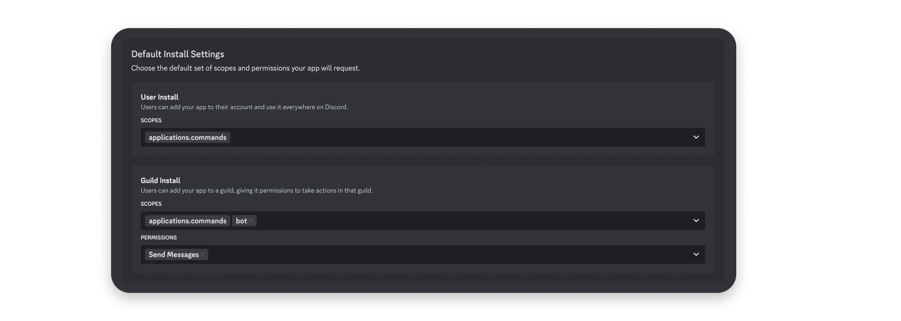

[Discord 应用](https://discord.com/developers/docs/quick-start/overview-of-apps)让您能够通过一系列 API 和交互功能来自定义和扩展 Discord。本指南将带您使用 JavaScript 构建您的第一个 Discord 应用，最终您将打造出一个能够使用斜杠命令、发送消息并响应组件交互的应用。

如果您有兴趣在 iframe 中构建游戏或社交体验，可以参考[构建活动](https://discord.com/developers/docs/activities/building-an-activity)的教程。

我们将构建一个 Discord 应用，让用户可以玩石头剪刀布（但包含 7 种选择，而非传统的 3 种）。本指南面向初学者，但假设您已具备一定的 [JavaScript](https://developer.mozilla.org/en-US/docs/Learn/Getting_started_with_the_web/JavaScript_basics) 基础知识。

!!! note
  译注: 本节中所有与示例项目相关的内容将默认折叠，以便阅读

## [步骤 0：项目设置](https://discord.com/developers/docs/quick-start/getting-started#step-0-project-setup)

??? note "代码内容，可无视"

  开始之前，您需要配置本地环境，并从[示例应用仓库](https://github.com/discord/discord-example-app)获取项目代码。

  我们将借助 [ngrok](https://ngrok.com/) 在本地进行开发，当然您也可以使用自己偏好的开发环境。

  如果您尚未安装 [NodeJS](https://nodejs.org/en/download/)，请先完成安装。

  安装 NodeJS 后，打开命令行并克隆项目代码：

  ```
  git clone https://github.com/discord/discord-example-app.git
  ```

  接着进入目录并安装项目依赖：

  ```
  # 进入目录
  cd discord-example-app
  # 安装依赖
  npm install
  ```

  本教程所用示例应用的项目结构概览

  完成以上步骤后，在您喜欢的代码编辑器中打开新项目，接下来我们将着手设置您的 Discord 应用。

## [步骤 1：创建应用](https://discord.com/developers/docs/quick-start/getting-started#step-1-creating-an-app)

首先，如果您还没有应用，需要在开发者门户中创建一个：

点击这里 ->  [创建应用](https://discord.com/developers/applications?new_application=true)

输入应用名称，然后点击“创建”。

创建应用后，您将进入应用设置的“通用信息”页面，可以在此更新应用的基本信息，例如描述和图标。您还会看到应用 ID 和交互端点 URL，这些将在指南后续部分使用。

### [获取凭据](https://discord.com/developers/docs/quick-start/getting-started#fetching-your-credentials)

我们需要设置并获取一些敏感信息，例如应用的令牌和 ID。

令牌用于授权 API 请求并承载应用的权限，因此极为敏感。请务必不要共享令牌或将其提交到任何版本控制系统。

??? note "示例项目配置，可无视"

  回到项目文件夹，将 `.env.sample` 文件重命名为 `.env`。我们将在此存储所有应用的凭据。

  您需要从应用设置中获取三个值并填入 `.env` 文件：

  *   在“通用信息”页面，复制应用 ID 的值。在 `.env` 文件中，将 `<YOUR_APP_ID>` 替换为您复制的 ID。
  *   返回“通用信息”页面，复制公钥的值（用于验证 HTTP 请求是否来自 Discord）。在 `.env` 文件中，将 `<YOUR_PUBLIC_KEY>` 替换为您复制的值。
  *   在“机器人”页面的“令牌”部分，点击“重置令牌”以生成新的机器人令牌。在 `.env` 文件中，将 `<YOUR_BOT_TOKEN>` 替换为您的新令牌。

除非重新生成，否则您将无法再次查看令牌，因此请务必将其保存在安全的地方（例如密码管理器）。

现在您已获得所需凭据，接下来让我们配置机器人用户和安装设置。

### [配置机器人](https://discord.com/developers/docs/quick-start/getting-started#configuring-your-bot) {: #set-bot }

新创建的应用默认启用了机器人用户。机器人用户使您的应用在[安装到服务器](https://discord.com/developers/docs/quick-start/overview-of-apps#where-are-apps-installed)时，能够像其他服务器成员一样出现和运作。

在应用设置的左侧边栏中，有一个“机器人”页面（我们之前在此获取了令牌）。在此页面，您还可以配置诸如[特权意图](https://discord.com/developers/docs/events/gateway#privileged-intents)或是否允许其他用户安装等设置。

!!! Info
  意图 (intent) 决定了当你的应用创建网关 API 连接时，Discord 将向其发送哪些事件。例如，如果你希望你的应用在用户给消息添加反应时执行某个操作，你可以传入 GUILD_MESSAGE_REACTIONS (1 << 10) 意图。  
  某些意图是特权意图，这意味着它们允许你的应用访问可能被视为敏感的数据（例如消息内容）。  
  特权意图可以在应用设置的“BOT”页面配置，但它们必须在你的应用通过验证之前获得批准。标准的非特权意图不需要任何额外的权限或配置。

关于意图的更多信息，以及可用意图的完整列表（及其相关联的事件）可在网关文档中找到。

目前我们无需在此进行额外配置，但根据您的应用使用场景，未来可能需要调整。现在让我们着手准备应用的安装设置。

### [选择安装上下文](https://discord.com/developers/docs/quick-start/getting-started#choosing-installation-contexts)

接下来，我们将确定您的应用在 Discord 中的安装位置，这取决于您的应用所支持的[安装上下文](https://discord.com/developers/docs/resources/application#installation-context)。

什么是安装上下文？

!!! Info
  安装上下文决定了您的应用可以安装在哪里：安装至服务器、安装至用户，或两者兼可。  
  安装在服务器环境中的应用必须由拥有 MANAGE_GUILD 权限的服务器成员授权，并对服务器的所有成员可见。  
  安装在用户环境中的应用仅对授权用户可见，因此不需要任何服务器特定的权限。它在用户的所有服务器、私信（DMs）和群组私信（GDMs）中都可见——但是，它们仅限于使用命令。

点击左侧边栏中的“安装”选项，然后在“安装上下文”部分确保同时勾选“用户安装”和“服务器安装”。

某些应用可能仅支持一种安装上下文——例如，审核类应用可能仅适用于服务器环境。但默认情况下，我们建议同时支持两种安装上下文。如需了解更多关于用户可安装应用的详细信息，请参阅[用户可安装应用教程](https://discord.com/developers/docs/tutorials/developing-a-user-installable-app)。

### [设置安装链接](https://discord.com/developers/docs/quick-start/getting-started#setting-up-an-install-link)

[安装链接](https://discord.com/developers/docs/resources/application#install-links)为用户提供了在 Discord 中安装应用的便捷方式。我们将配置默认的 [Discord 提供链接](https://discord.com/developers/docs/resources/application#discord-provided-link)，但您也可以在[应用文档](https://discord.com/developers/docs/resources/application#types-of-install-links)中了解更多不同类型的安装链接。

在安装页面中，进入“安装链接”部分，如果尚未选中，请选择“Discord 提供链接”。

选择 Discord 提供链接后，将出现一个新的“默认安装设置”部分，接下来我们将对其进行配置。

### [添加作用域和机器人权限](https://discord.com/developers/docs/quick-start/getting-started#adding-scopes-and-bot-permissions) {: #add-scopes-permissions }

应用需要获得安装用户的授权才能在 Discord 中执行操作（例如创建斜杠命令或获取服务器成员列表）。在安装应用之前，让我们先添加作用域和权限。

!!! Info 什么是作用域和权限？
  创建应用程序时，作用域和权限决定了你的应用程序在 Discord 中能够执行的操作和能够访问的内容。  
  OAuth2 作用域 (SCOPES) 决定了您的应用在 Discord 中可以执行的操作和访问的内容。这是由安装应用到服务器的用户授予的。  
  权限 (Bot Permissions) 是针对你的机器人的细粒度权限，与 Discord 中其他用户所拥有的权限相同。它们可以由安装用户批准，或稍后在服务器设置中或通过权限覆盖进行更新。这些权限仅适用于安装到服务器的应用，因为安装到用户上下文的应用程序只能响应命令。

在安装页面的“默认安装设置”部分：

*   对于用户安装，添加 `applications.commands` 权限范围。
*   对于服务器安装，添加 `applications.commands` 权限范围和 `bot` 权限范围。选择 `bot` 后，将出现一个新的“权限”菜单，用于选择机器人用户的权限。选择您的应用可能需要的任何权限——目前，我仅选择 `发送消息` 权限。



查看所有 [OAuth2 作用域](https://discord.com/developers/docs/topics/oauth2#shared-resources-oauth2-scopes) 列表，或在文档中了解更多关于 [权限](https://discord.com/developers/docs/topics/permissions) 的信息。

### [安装您的应用](https://discord.com/developers/docs/quick-start/getting-started#installing-your-app)

开发应用时，建议您在自己的用户账户（针对用户可安装应用）以及他人未活跃使用的服务器（针对服务器可安装应用）上进行构建和测试。如果您还没有自己的服务器，可以[免费创建一个](https://support.discord.com/hc/en-us/articles/204849977-How-do-I-create-a-server-)。

添加作用域后，复制之前“安装链接”部分的 URL。

由于我们的应用支持两种安装上下文，我们将把新应用安装到测试服务器和您的用户账户，以便在两种[安装上下文](https://discord.com/developers/docs/resources/application#installation-context)中进行测试。

###### [安装到服务器](https://discord.com/developers/docs/quick-start/getting-started#installing-your-app-install-to-server)

要将应用安装到测试服务器，请从安装页面复制应用的默认安装链接。将链接粘贴到浏览器中并按回车键，然后在安装提示中选择“添加到服务器”。

选择您的测试服务器，并按照安装提示操作。应用成功添加到测试服务器后，您应该能在成员列表中看到它。

###### [安装到用户账户](https://discord.com/developers/docs/quick-start/getting-started#installing-your-app-install-to-user-account)

接下来，将应用安装到您的用户账户。在浏览器中粘贴相同的安装链接并按回车键。这次，在安装提示中选择“添加到我的应用”。

按照安装提示将应用安装到您的用户账户。安装完成后，您可以与其开启私信对话。

* * *

## [第二步：运行您的应用](https://discord.com/developers/docs/quick-start/getting-started#step-2-running-your-app) 

??? note "示例项目代码，可无视"

  将您的应用程序配置并安装到测试服务器和账户后，接下来我们一同探索代码部分。

  为简化开发流程，本应用使用了[discord-interactions](https://github.com/discord/discord-interactions-js)，它提供了类型定义和一系列辅助函数。若您倾向于使用其他语言或库，可参考[社区资源](https://discord.com/developers/docs/developer-tools/community-resources)文档。

  ### [安装斜杠命令](https://discord.com/developers/docs/quick-start/getting-started#installing-slash-commands)

  安装斜杠命令时，应用采用了[`node-fetch`](https://github.com/node-fetch/node-fetch)。具体实现可在`utils.js`文件内的`DiscordRequest()`函数中查看。

  项目中包含一个`register`脚本，用于安装`commands.js`底部定义的`ALL_COMMANDS`命令集。该脚本通过调用HTTP API的[`PUT /applications/<APP_ID>/commands`](https://discord.com/developers/docs/interactions/application-commands#bulk-overwrite-global-application-commands)端点，将这些命令注册为全局命令。

  如需自定义命令或添加新命令，可参考[命令文档](https://discord.com/developers/docs/interactions/application-commands#application-command-object-application-command-structure)中的命令结构说明。

  请在项目文件夹内的终端中运行以下命令：

  ```
  ├── examples    -> 简短且功能特定的示例应用
  │   ├── app.js  -> 完整的app.js代码
  │   ├── button.js
  │   ├── command.js
  │   ├── modal.js
  │   ├── selectMenu.js
  ├── .env        -> 存储您的凭据和ID
  ├── app.js      -> 应用的主入口文件
  ├── commands.js -> 斜杠命令负载及辅助功能
  ├── game.js     -> 石头剪刀布游戏专用逻辑
  ├── utils.js    -> 实用函数与常量定义
  ├── package.json
  ├── README.md
  └── .gitignore
  ```

  返回您的服务器后，应能看到斜杠命令已显示。但若尝试运行，目前不会有任何反应，因为应用尚未接收或处理来自Discord的请求。

* * *

## [步骤3：处理交互](https://discord.com/developers/docs/quick-start/getting-started#step-3-handling-interactivity)

为使应用能够接收斜杠命令及其他交互请求，Discord需要一个可公开访问的URL来发送这些请求。该URL可在应用的设置中配置为“交互端点URL”。

### [设置公共端点](https://discord.com/developers/docs/quick-start/getting-started#set-up-a-public-endpoint)

要设置公共端点，我们将启动基于[Express](https://expressjs.com/)框架的应用服务器，并借助[ngrok](https://ngrok.com/)将其公开至互联网。

首先，进入项目文件夹并运行以下命令以启动应用：

```
npm run register
```

此时应有输出提示应用正运行在端口`3000`。实际上，应用已在后台准备好处理来自Discord的交互请求，包括验证安全请求头及响应`PING`请求。本教程略过了许多实现细节，完整内容可参阅[交互概述](https://discord.com/developers/docs/interactions/overview#preparing-for-interactions)文档。

默认情况下，服务器监听3000端口的请求，如需更改端口，可在`.env`文件中设置`PORT`变量。

接下来启动ngrok隧道。若本地尚未安装ngrok，请按[ngrok下载页](https://ngrok.com/download)的指引完成安装。

安装完成后，打开新终端并创建公共端点，将请求转发至Express服务器：

```
npm run start
```

连接建立后，您将看到类似如下的输出：

```
ngrok http 3000
```

下一步中，我们将使用此转发URL作为公共可访问地址，供Discord发送交互请求。

### [添加交互端点URL](https://discord.com/developers/docs/quick-start/getting-started#adding-an-interaction-endpoint-url)

进入您的[应用设置](https://discord.com/developers/applications)，在“常规信息”页的“交互端点URL”栏中，粘贴新的ngrok转发URL并追加`/interactions`。


点击“保存更改”，并确认端点验证成功。

若验证遇到问题，请检查ngrok与应用是否运行在同一端口，并确认已正确复制ngrok URL。

示例应用通过两种方式自动处理验证流程：

*   它利用 `PUBLIC_KEY` 和 [discord-interactions 包](https://github.com/discord/discord-interactions-js#usage)，并通过一个包装函数（从 `utils.js` 导入）使其适配 [Express 的 `verify` 接口](http://expressjs.com/en/5x/api.html#express.json)。该过程会在每一个传入应用的请求中执行。
*   它能够响应传入的 `PING` 请求。

关于如何配置应用以接收交互的更多信息，可查阅 [交互相关文档](https://discord.com/developers/docs/interactions/overview#preparing-for-interactions)。

### [处理斜杠命令请求](https://discord.com/developers/docs/quick-start/getting-started#handling-slash-command-requests)

在端点验证通过后，请导航至项目中的 `app.js` 文件，并找到处理 `/test` 命令的代码块：

```
// "test" command
if (name === 'test') {
  // Send a message into the channel where command was triggered from
  return res.send({
    type: InteractionResponseType.CHANNEL_MESSAGE_WITH_SOURCE,
    data: {
      flags: InteractionResponseFlags.IS_COMPONENTS_V2,
      components: [
        {
          type: MessageComponentTypes.TEXT_DISPLAY,
          // Fetches a random emoji to send from a helper function
          content: `hello world ${getRandomEmoji()}`
        }
      ]
    },
  });
}
```

上述代码会在发起交互的频道、私信或群组私信中返回一条消息作为响应。所有可用的响应类型（例如使用模态框进行响应）均可在 [官方文档](https://discord.com/developers/docs/interactions/receiving-and-responding#interaction-response-object-interaction-callback-type) 中查阅。

请前往您的服务器，确保应用的 `/test` 斜杠命令正常工作。触发该命令时，应用应当发送一条包含“hello world”并附带随机表情符号的消息。

在接下来的部分，我们将添加一个额外命令，该命令会使用斜杠命令选项、按钮和选择菜单，来构建一个石头剪刀布游戏。

* * *

## [步骤 4：添加消息组件](https://discord.com/developers/docs/quick-start/getting-started#step-4-adding-message-components)

`/challenge` 命令用于启动我们设计的石头剪刀布风格游戏。一旦该命令被触发，应用就会向频道发送消息组件，引导用户完成游戏流程。

### [添加带选项的命令](https://discord.com/developers/docs/quick-start/getting-started#adding-a-command-with-options)

`/challenge` 命令（在 `commands.js` 中命名为 `CHALLENGE_COMMAND`）带有一个 `options` 数组。在我们的应用中，这些选项是对象，代表用户在玩石头剪刀布时可选择的不同内容，它们由 `game.js` 中的 `RPSChoices` 键生成。

有关命令选项及其结构的更多信息，请参见 [相关文档](https://discord.com/developers/docs/interactions/application-commands#application-command-object-application-command-option-structure)。

虽然本指南不会深入讲解 `game.js` 文件，但欢迎您自行探索并修改命令或其选项。

用于处理挑战命令并通过带按钮的消息进行响应的代码

```
// "challenge" command
if (name === 'challenge' && id) {
  // Interaction context
  const context = req.body.context;
  // User ID is in user field for (G)DMs, and member for servers
  const userId = context === 0 ? req.body.member.user.id : req.body.user.id;
  // User's object choice
  const objectName = req.body.data.options[0].value;

  // Create active game using message ID as the game ID
  activeGames[id] = {
    id: userId,
    objectName,
  };

  return res.send({
    type: InteractionResponseType.CHANNEL_MESSAGE_WITH_SOURCE,
    data: {
      flags: InteractionResponseFlags.IS_COMPONENTS_V2,
      components: [
        {
          type: MessageComponentTypes.TEXT_DISPLAY,
          // Fetches a random emoji to send from a helper function
          content: `Rock papers scissors challenge from <@${userId}>`,
        },
        {
          type: MessageComponentTypes.ACTION_ROW,
          components: [
            {
              type: MessageComponentTypes.BUTTON,
              // Append the game ID to use later on
              custom_id: `accept_button_${req.body.id}`,
              label: 'Accept',
              style: ButtonStyleTypes.PRIMARY,
            },
          ],
        },
      ],
    },
  });
}
```


用于处理按钮点击并以短暂消息响应的代码

```
if (type === InteractionType.MESSAGE_COMPONENT) {
  // custom_id set in payload when sending message component
  const componentId = data.custom_id;

  if (componentId.startsWith('accept_button_')) {
    // get the associated game ID
    const gameId = componentId.replace('accept_button_', '');
    // Delete message with token in request body
    const endpoint = `webhooks/${process.env.APP_ID}/${req.body.token}/messages/${req.body.message.id}`;
    try {
      await res.send({
        type: InteractionResponseType.CHANNEL_MESSAGE_WITH_SOURCE,
        data: {
          // Indicates it'll be an ephemeral message
          flags: InteractionResponseFlags.EPHEMERAL | InteractionResponseFlags.IS_COMPONENTS_V2,
          components: [
            {
              type: MessageComponentTypes.TEXT_DISPLAY,
              content: 'What is your object of choice?',
            },
            {
              type: MessageComponentTypes.ACTION_ROW,
              components: [
                {
                  type: MessageComponentTypes.STRING_SELECT,
                  // Append game ID
                  custom_id: `select_choice_${gameId}`,
                  options: getShuffledOptions(),
                },
              ],
            },
          ],
        },
      });
      // Delete previous message
      await DiscordRequest(endpoint, { method: 'DELETE' });
    } catch (err) {
      console.error('Error sending message:', err);
    }
  }
  return;
}

```

响应选择菜单交互和更新游戏状态的代码

```
if (type === InteractionType.MESSAGE_COMPONENT) {
  // custom_id set in payload when sending message component
  const componentId = data.custom_id;

  if (componentId.startsWith('accept_button_')) {
    // get the associated game ID
    const gameId = componentId.replace('accept_button_', '');
    // Delete message with token in request body
    const endpoint = `webhooks/${process.env.APP_ID}/${req.body.token}/messages/${req.body.message.id}`;
    try {
      await res.send({
        type: InteractionResponseType.CHANNEL_MESSAGE_WITH_SOURCE,
        data: {
          // Indicates it'll be an ephemeral message
          flags: InteractionResponseFlags.EPHEMERAL | InteractionResponseFlags.IS_COMPONENTS_V2,
          components: [
            {
              type: MessageComponentTypes.TEXT_DISPLAY,
              content: 'What is your object of choice?',
            },
            {
              type: MessageComponentTypes.ACTION_ROW,
              components: [
                {
                  type: MessageComponentTypes.STRING_SELECT,
                  // Append game ID
                  custom_id: `select_choice_${gameId}`,
                  options: getShuffledOptions(),
                },
              ],
            },
          ],
        },
      });
      // Delete previous message
      await DiscordRequest(endpoint, { method: 'DELETE' });
    } catch (err) {
      console.error('Error sending message:', err);
    }
  } else if (componentId.startsWith('select_choice_')) {
    // get the associated game ID
    const gameId = componentId.replace('select_choice_', '');

    if (activeGames[gameId]) {
      // Interaction context
      const context = req.body.context;
      // Get user ID and object choice for responding user
      // User ID is in user field for (G)DMs, and member for servers
      const userId = context === 0 ? req.body.member.user.id : req.body.user.id;
      const objectName = data.values[0];
      // Calculate result from helper function
      const resultStr = getResult(activeGames[gameId], {
        id: userId,
        objectName,
      });

      // Remove game from storage
      delete activeGames[gameId];
      // Update message with token in request body
      const endpoint = `webhooks/${process.env.APP_ID}/${req.body.token}/messages/${req.body.message.id}`;

      try {
        // Send results
        await res.send({
          type: InteractionResponseType.CHANNEL_MESSAGE_WITH_SOURCE,
          data: {
            flags: InteractionResponseFlags.IS_COMPONENTS_V2,
            components: [
              {
                type: MessageComponentTypes.TEXT_DISPLAY,
                content: resultStr
              }
            ]
            },
        });
        // Update ephemeral message
        await DiscordRequest(endpoint, {
          method: 'PATCH',
          body: {
            components: [
              {
                type: MessageComponentTypes.TEXT_DISPLAY,
                content: 'Nice choice ' + getRandomEmoji()
              }
            ],
          },
        });
      } catch (err) {
        console.error('Error sending message:', err);
      }
    }
  }

  return;
}
```

……大功告成！🎊 现在就去测试您的应用，确保一切运转如常。

* * *

## [后续步骤](https://discord.com/developers/docs/quick-start/getting-started#next-steps)

恭喜！您已成功构建第一个 Discord 应用！🤖

希望您从中了解了 Discord 应用的基本配置与交互实现。接下来，您可以继续扩展应用功能，或探索更多可能性。
