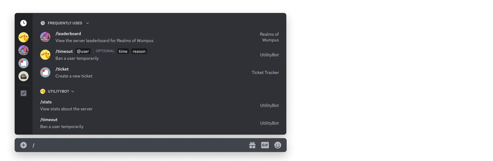
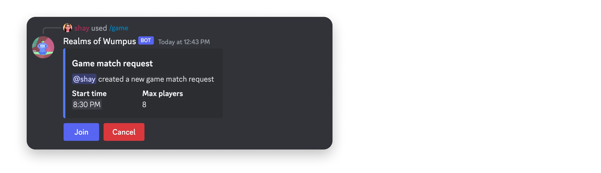
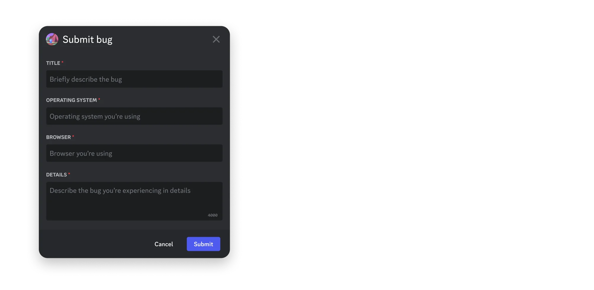

# [交互功能概述](https://discord.com/developers/docs/interactions/overview#overview-of-interactions)

诸如命令和消息组件之类的交互功能允许用户在Discord内原生调用应用程序。当用户与您应用的交互功能互动时，您的应用将收到一个[交互对象](https://discord.com/developers/docs/interactions/receiving-and-responding#interaction-object)。

本概述包括主要交互类型的概览，以及为您准备应用使用和接收交互的步骤。有关处理交互的参考文档和详细信息，请参阅[接收与响应](https://discord.com/developers/docs/interactions/receiving-and-responding)。

* * *

## [交互类型](https://discord.com/developers/docs/interactions/overview#types-of-interactions)

您应用的工具箱中有多种交互类型，可以选择并组合使用，以在Discord中构建引人入胜的交互体验。

### [命令](https://discord.com/developers/docs/interactions/overview#commands)

[应用程序命令](https://discord.com/developers/docs/interactions/application-commands)为用户提供在Discord中调用应用的原生方式。它们通常映射到应用的核心功能或特性。



当应用创建命令时，可以选择命令的类型，这决定了它在Discord客户端中的显示位置以及调用命令时应用将接收的元数据。应用程序命令有三种类型：

*   斜杠命令是最常见的命令类型，通过在聊天输入框中输入`/`或打开命令选择器来访问。
*   消息命令是与消息或消息内容相关的命令。通过点击消息右上角的上下文菜单（三个点）（或右键点击消息），然后导航至"应用"部分来访问。
*   用户命令是与Discord中用户相关的命令。通过右键点击用户个人资料，然后导航至"应用"部分来访问。
*   入口点命令是作为从应用启动器启动[活动](https://discord.com/developers/docs/activities/overview)的主要方式使用的命令。

有关创建命令和处理命令交互的详细信息，请参阅[应用程序命令](https://discord.com/developers/docs/interactions/application-commands)文档。

### [消息组件](https://discord.com/developers/docs/interactions/overview#message-components)

[消息组件](https://discord.com/developers/docs/components/reference)是可以在您的应用在Discord中发送的消息内容中包含的交互元素。



应用可以在消息中发送的主要交互组件包括：

*   [按钮](https://discord.com/developers/docs/components/reference#button)是可点击的组件，可以使用不同的样式、文本和表情符号进行自定义。
*   [静态选择菜单](https://discord.com/developers/docs/components/reference#string-select)是用户可以打开以查看开发者定义的选择选项列表的组件，这些选项具有自定义标签和描述。
*   [自动填充选择菜单](https://discord.com/developers/docs/components/reference#string-select)是一组四种不同的选择组件，它们会填充上下文相关的Discord资源，如服务器中的用户列表或频道列表。

所有消息组件的列表以及发送和接收组件交互的详细信息，请参阅[消息组件](https://discord.com/developers/docs/components/reference)文档。

### [模态框](https://discord.com/developers/docs/interactions/overview#modals)

[模态框](https://discord.com/developers/docs/interactions/receiving-and-responding#interaction-response-object-modal)是单用户弹出界面，允许应用收集类似表单的数据。模态框只能在用户调用您应用的命令或消息组件时作为响应打开。



模态框可以包含的组件可在[组件参考](https://discord.com/developers/docs/components/reference)中找到。模态框提交后接收的数据可在[每个组件的交互响应结构](https://discord.com/developers/docs/interactions/receiving-and-responding#interaction-response-object-modal)中找到。

有关创建和使用模态框的详细信息，请参阅[接收与响应](https://discord.com/developers/docs/interactions/receiving-and-responding#interaction-response-object-modal)文档。

* * *

## [为交互做准备](https://discord.com/developers/docs/interactions/overview#preparing-for-interactions)

当用户与您的应用交互时，您可以选择让您的应用以两种互斥的方式接收交互：

*   基于WebSocket的网关连接
*   通过传出Webhook的HTTP

默认情况下，您的应用程序将通过网关连接接收交互，但您可以通过在应用程序设置中添加交互端点URL来选择基于HTTP的交互。有关处理交互的技术细节，请参阅[接收和响应](https://discord.com/developers/docs/interactions/receiving-and-responding)文档。

### [配置交互端点URL](https://discord.com/developers/docs/interactions/overview#configuring-an-interactions-endpoint-url)

交互端点URL是您应用程序的公共端点，Discord可以在此向您的应用程序发送基于HTTP的交互。如果您的应用程序使用基于[网关](https://discord.com/developers/docs/events/gateway)的交互，则无需配置交互端点URL。

#### [设置端点](https://discord.com/developers/docs/interactions/overview#setting-up-an-endpoint)

在将交互端点URL添加到您的应用程序之前，您的端点必须提前准备好两件事：

1.  确认来自Discord的`PING`请求
2.  验证与安全相关的请求头（`X-Signature-Ed25519`和`X-Signature-Timestamp`）

如果其中任何一项未完成，您的交互端点URL将无法通过验证。有关确认PING请求和验证安全相关标头的详细信息，请参阅以下部分。

###### [确认PING请求](https://discord.com/developers/docs/interactions/overview#setting-up-an-endpoint-acknowledging-ping-requests)

在添加交互端点URL时，Discord将向您的端点发送带有`PING`负载（类型为`type: 1`）的`POST`请求。您的应用程序需要通过返回带有`PONG`负载（同样具有`type: 1`）的`200`响应来确认请求。有关交互响应的详细信息，请参阅[接收和响应文档](https://discord.com/developers/docs/interactions/receiving-and-responding)。

在响应`PING`时，您必须提供有效的`Content-Type`。更多信息请参见[此处](https://discord.com/developers/docs/reference#http-api)。

响应PING请求

确认PING交互的代码示例

要正确确认`PING`负载，请返回带有`type: 1`负载的`200`响应：

```
@app.route('/', methods=['POST'])
def my_command():
　　　　if request.json["type"] == 1:
　　　　　　　　return jsonify({
　　　　　　　　　　　　"type": 1
　　　　　　　　})
```

###### [验证安全请求头](https://discord.com/developers/docs/interactions/overview#setting-up-an-endpoint-validating-security-request-headers)

互联网是一个危险的地方，特别是对于托管公共、未经身份验证的端点的人来说。要通过HTTP接收交互，在您的应用程序有资格接收请求之前，必须采取一些安全步骤。

每个交互都附带以下标头：

*   `X-Signature-Ed25519`作为签名
*   `X-Signature-Timestamp`作为时间戳

使用您喜欢的安全库，每次收到[交互](https://discord.com/developers/docs/interactions/receiving-and-responding#interaction-object)时都必须验证请求。如果签名验证失败，您的应用程序应返回`401`错误代码。

验证安全头

验证安全相关请求头的代码示例

以下是一些代码示例，展示了如何验证交互请求中发送的标头。

JavaScript

```
const nacl = require("tweetnacl");

// 您的公钥可以在开发者门户中的应用程序上找到
const PUBLIC_KEY = "APPLICATION_PUBLIC_KEY";

const signature = req.get("X-Signature-Ed25519");
const timestamp = req.get("X-Signature-Timestamp");
const body = req.rawBody; // rawBody应为字符串，而非原始字节

const isVerified = nacl.sign.detached.verify(
　　　　Buffer.from(timestamp + body),
　　　　Buffer.from(signature, "hex"),
　　　　Buffer.from(PUBLIC_KEY, "hex")
);

if (!isVerified) {
　　　　return res.status(401).end("invalid request signature");
}
```

Python

```
from nacl.signing import VerifyKey
from nacl.exceptions import BadSignatureError

# 您的公钥可以在开发者门户中的应用程序上找到
PUBLIC_KEY = 'APPLICATION_PUBLIC_KEY'

verify_key = VerifyKey(bytes.fromhex(PUBLIC_KEY))

signature = request.headers["X-Signature-Ed25519"]
timestamp = request.headers["X-Signature-Timestamp"]
body = request.data.decode("utf-8")

try:
　　　　verify_key.verify(f'{timestamp}{body}'.encode(), bytes.fromhex(signature))
except BadSignatureError:
　　　　abort(401, 'invalid request signature')
```

除了确保您的应用在保存终端点时验证与安全相关的请求头外，Discord 还会对您的终端点执行自动化的例行安全检查，包括故意向您发送无效签名。如果验证失败，我们将移除您的交互 URL，并通过电子邮件和系统 DM 提醒您。

我们强烈建议查看我们的 [社区资源](https://discord.com/developers/docs/developer-tools/community-resources#interactions) 以及其中提供的库。它们不仅为交互数据模型提供类型支持，还包括适用于 Flask 和 Express 等 API 框架的装饰器，使验证变得简单。

#### [添加交互终端点 URL](https://discord.com/developers/docs/interactions/overview#adding-an-interactions-endpoint-url)

当您拥有一个公共终端点作为应用的交互终端点 URL 后，您可以通过访问 [应用设置](https://discord.com/developers/applications) 将其添加到您的应用中。

在常规概览页面中，找到交互终端点 URL 字段。粘贴您已设置为确认 `PING` 消息并正确处理与安全相关的签名头的公共 URL。

* * *

## [处理交互](https://discord.com/developers/docs/interactions/overview#handling-interactions)

一旦您的应用准备好处理交互，您可以查阅 [接收与响应](https://discord.com/developers/docs/interactions/receiving-and-responding) 文档，其中详细介绍了在应用中处理交互请求的技术细节。
