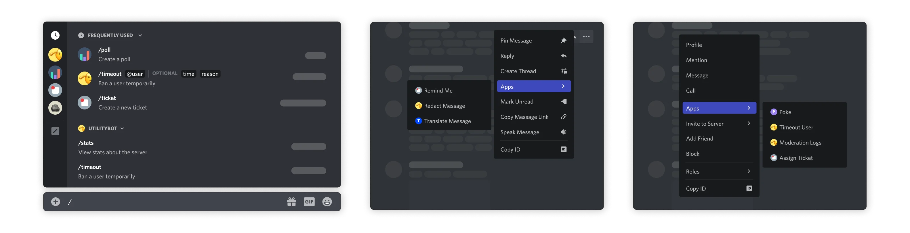
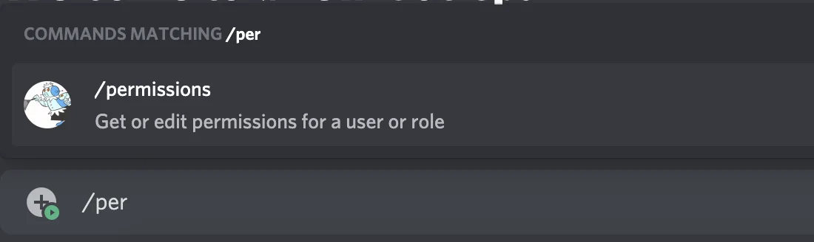
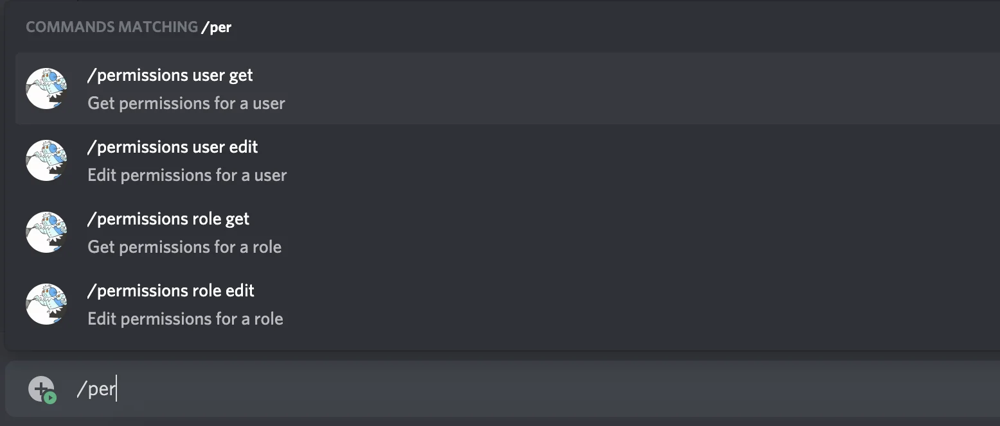
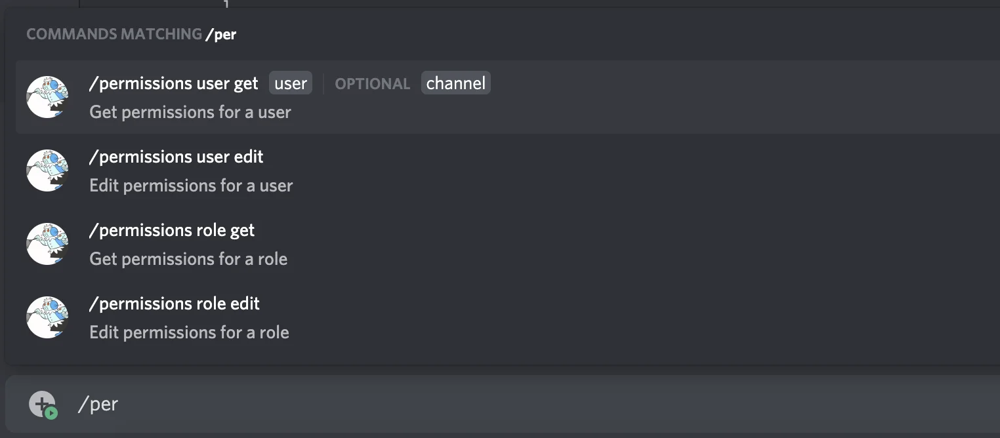
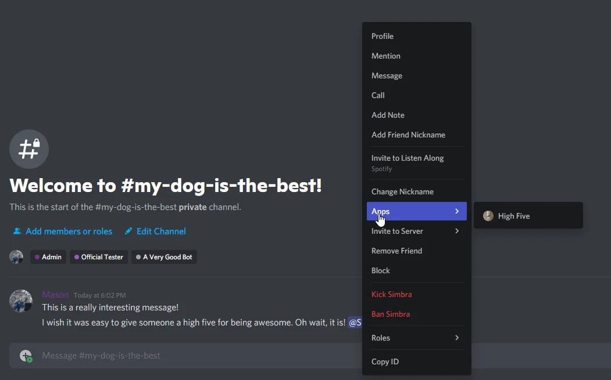
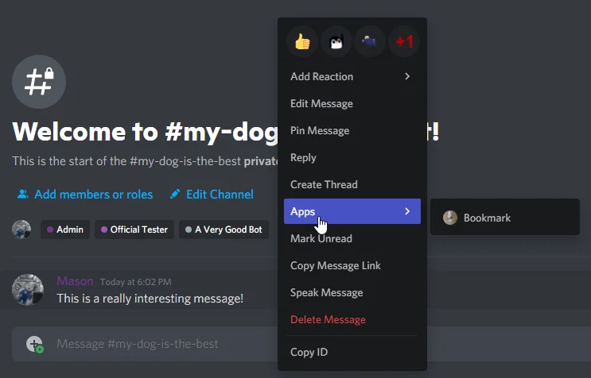

Application Commands[](https://discord.com/developers/docs/interactions/application-commands#application-commands)
==================================================================================================================

Application commands are native ways to interact with apps in the Discord client. There are 3 types of commands accessible in different interfaces: the chat input, a message's context menu (top-right menu or right-clicking in a message), and a user's context menu (right-clicking on a user).



Application Command Object[](https://discord.com/developers/docs/interactions/application-commands#application-command-object)
------------------------------------------------------------------------------------------------------------------------------

###### Application Command Naming[](https://discord.com/developers/docs/interactions/application-commands#application-command-object-application-command-naming)

`CHAT_INPUT` command names and command option names must match the following regex `^[-_'\p{L}\p{N}\p{sc=Deva}\p{sc=Thai}]{1,32}$` with the unicode flag set. If there is a lowercase variant of any letters used, you must use those. Characters with no lowercase variants and/or uncased letters are still allowed. `USER` and `MESSAGE` commands may be mixed case and can include spaces.

###### Application Command Structure[](https://discord.com/developers/docs/interactions/application-commands#application-command-object-application-command-structure)

<table><thead><tr><th>Field</th><th>Type</th><th>Description</th><th>Valid Types</th></tr></thead><tbody><tr><td>id</td><td>snowflake</td><td>Unique ID of command</td><td>all</td></tr><tr><td>type?</td><td>one of <a aria-current="page" class="link-3m0lUT" href="https://discord.com/developers/docs/interactions/application-commands#application-command-object-application-command-types" data-discover="true">command types</a></td><td><a aria-current="page" class="link-3m0lUT" href="https://discord.com/developers/docs/interactions/application-commands#application-command-object-application-command-types" data-discover="true">Type of command</a>, defaults to <code>1</code></td><td>all</td></tr><tr><td>application_id</td><td>snowflake</td><td>ID of the parent application</td><td>all</td></tr><tr><td>guild_id?</td><td>snowflake</td><td>Guild ID of the command, if not global</td><td>all</td></tr><tr><td>name</td><td>string</td><td><a aria-current="page" class="link-3m0lUT" href="https://discord.com/developers/docs/interactions/application-commands#application-command-object-application-command-naming" data-discover="true">Name of command</a>, 1-32 characters</td><td>all</td></tr><tr><td>name_localizations?</td><td>?dictionary with keys in <a class="link-3m0lUT" href="https://discord.com/developers/docs/reference#locales" data-discover="true">available locales</a></td><td>Localization dictionary for <code>name</code> field. Values follow the same restrictions as <code>name</code></td><td>all</td></tr><tr><td>description</td><td>string</td><td>Description for <code>CHAT_INPUT</code> commands, 1-100 characters. Empty string for <code>USER</code> and <code>MESSAGE</code> commands</td><td>all</td></tr><tr><td>description_localizations?</td><td>?dictionary with keys in <a class="link-3m0lUT" href="https://discord.com/developers/docs/reference#locales" data-discover="true">available locales</a></td><td>Localization dictionary for <code>description</code> field. Values follow the same restrictions as <code>description</code></td><td>all</td></tr><tr><td>options? *</td><td>array of <a aria-current="page" class="link-3m0lUT" href="https://discord.com/developers/docs/interactions/application-commands#application-command-object-application-command-option-structure" data-discover="true">command options</a></td><td>Parameters for the command, max of 25</td><td>CHAT_INPUT</td></tr><tr><td>default_member_permissions</td><td>?string</td><td>Set of <a class="link-3m0lUT" href="https://discord.com/developers/docs/topics/permissions" data-discover="true">permissions</a> represented as a bit set</td><td>all</td></tr><tr><td>dm_permission?</td><td>boolean</td><td>Deprecated (use <code>contexts</code> instead); Indicates whether the command is available in DMs with the app, only for globally-scoped commands. By default, commands are visible.</td><td>all</td></tr><tr><td>default_permission?</td><td>?boolean</td><td>Not recommended for use as field will soon be deprecated. Indicates whether the command is enabled by default when the app is added to a guild, defaults to <code>true</code></td><td>all</td></tr><tr><td>nsfw?</td><td>boolean</td><td>Indicates whether the command is <a aria-current="page" class="link-3m0lUT" href="https://discord.com/developers/docs/interactions/application-commands#agerestricted-commands" data-discover="true">age-restricted</a>, defaults to <code>false</code></td><td>all</td></tr><tr><td>integration_types?</td><td>list of <a class="link-3m0lUT" href="https://discord.com/developers/docs/resources/application#application-object-application-integration-types" data-discover="true">integration types</a></td><td><a class="link-3m0lUT" href="https://discord.com/developers/docs/resources/application#installation-context" data-discover="true">Installation contexts</a> where the command is available, only for globally-scoped commands. Defaults to your app's <a class="link-3m0lUT" href="https://discord.com/developers/docs/resources/application#setting-supported-installation-contexts" data-discover="true">configured contexts</a></td><td>all</td></tr><tr><td>contexts?</td><td>?list of <a class="link-3m0lUT" href="https://discord.com/developers/docs/interactions/receiving-and-responding#interaction-object-interaction-context-types" data-discover="true">interaction context types</a></td><td><a class="link-3m0lUT" href="https://discord.com/developers/docs/interactions/receiving-and-responding#interaction-object-interaction-context-types" data-discover="true">Interaction context(s)</a> where the command can be used, only for globally-scoped commands.</td><td>all</td></tr><tr><td>version</td><td>snowflake</td><td>Autoincrementing version identifier updated during substantial record changes</td><td>all</td></tr><tr><td>handler?</td><td>one of <a aria-current="page" class="link-3m0lUT" href="https://discord.com/developers/docs/interactions/application-commands#application-command-object-entry-point-command-handler-types" data-discover="true">command handler types</a></td><td>Determines whether the interaction is handled by the app's interactions handler or by Discord</td><td>PRIMARY_ENTRY_POINT</td></tr></tbody></table>

* `options` can only be set for application commands of type `CHAT_INPUT`.

* `handler` can only be set for application commands of type `PRIMARY_ENTRY_POINT` for applications with the `EMBEDDED` flag (i.e. applications that have an Activity).

`default_permission` will soon be deprecated. You can instead set `default_member_permissions` to `"0"` to disable the command for everyone except admins by default, and/or use `contexts` to disable globally-scoped commands inside of DMs with your app

###### Application Command Types[](https://discord.com/developers/docs/interactions/application-commands#application-command-object-application-command-types)

<table><thead><tr><th>Name</th><th>Type</th><th>Description</th></tr></thead><tbody><tr><td>CHAT_INPUT</td><td>1</td><td>Slash commands; a text-based command that shows up when a user types <code>/</code></td></tr><tr><td>USER</td><td>2</td><td>A UI-based command that shows up when you right click or tap on a user</td></tr><tr><td>MESSAGE</td><td>3</td><td>A UI-based command that shows up when you right click or tap on a message</td></tr><tr><td>PRIMARY_ENTRY_POINT</td><td>4</td><td>A UI-based command that represents the primary way to invoke an app's <a class="link-3m0lUT" href="https://discord.com/developers/docs/activities/overview" data-discover="true">Activity</a></td></tr></tbody></table>

###### Application Command Option Structure[](https://discord.com/developers/docs/interactions/application-commands#application-command-object-application-command-option-structure)

Required `options` must be listed before optional options<table><thead><tr><th>Field</th><th>Type</th><th>Description</th><th>Valid Option Types</th></tr></thead><tbody><tr><td>type</td><td>one of <a aria-current="page" class="link-3m0lUT" href="https://discord.com/developers/docs/interactions/application-commands#application-command-object-application-command-option-type" data-discover="true">application command option type</a></td><td>Type of option</td><td>all</td></tr><tr><td>name *</td><td>string</td><td><a aria-current="page" class="link-3m0lUT" href="https://discord.com/developers/docs/interactions/application-commands#application-command-object-application-command-naming" data-discover="true">1-32 character name</a></td><td>all</td></tr><tr><td>name_localizations?</td><td>?dictionary with keys in <a class="link-3m0lUT" href="https://discord.com/developers/docs/reference#locales" data-discover="true">available locales</a></td><td>Localization dictionary for the <code>name</code> field. Values follow the same restrictions as <code>name</code></td><td>all</td></tr><tr><td>description</td><td>string</td><td>1-100 character description</td><td>all</td></tr><tr><td>description_localizations?</td><td>?dictionary with keys in <a class="link-3m0lUT" href="https://discord.com/developers/docs/reference#locales" data-discover="true">available locales</a></td><td>Localization dictionary for the <code>description</code> field. Values follow the same restrictions as <code>description</code></td><td>all</td></tr><tr><td>required?</td><td>boolean</td><td>Whether the parameter is required or optional, default <code>false</code></td><td>all but <code>SUB_COMMAND</code> and <code>SUB_COMMAND_GROUP</code></td></tr><tr><td>choices?</td><td>array of <a aria-current="page" class="link-3m0lUT" href="https://discord.com/developers/docs/interactions/application-commands#application-command-object-application-command-option-choice-structure" data-discover="true">application command option choice</a></td><td>Choices for the user to pick from, max 25</td><td><code>STRING</code>, <code>INTEGER</code>, <code>NUMBER</code></td></tr><tr><td>options?</td><td>array of <a aria-current="page" class="link-3m0lUT" href="https://discord.com/developers/docs/interactions/application-commands#application-command-object-application-command-option-structure" data-discover="true">application command option</a></td><td>If the option is a subcommand or subcommand group type, these nested options will be the parameters or subcommands respectively; up to 25</td><td><code>SUB_COMMAND</code> , <code>SUB_COMMAND_GROUP</code></td></tr><tr><td>channel_types?</td><td>array of <a class="link-3m0lUT" href="https://discord.com/developers/docs/resources/channel#channel-object-channel-types" data-discover="true">channel types</a></td><td>The channels shown will be restricted to these types</td><td><code>CHANNEL</code></td></tr><tr><td>min_value?</td><td>integer for <code>INTEGER</code> options, double for <code>NUMBER</code> options</td><td>The minimum value permitted</td><td><code>INTEGER</code> , <code>NUMBER</code></td></tr><tr><td>max_value?</td><td>integer for <code>INTEGER</code> options, double for <code>NUMBER</code> options</td><td>The maximum value permitted</td><td><code>INTEGER</code> , <code>NUMBER</code></td></tr><tr><td>min_length?</td><td>integer</td><td>The minimum allowed length (minimum of <code>0</code>, maximum of <code>6000</code>)</td><td><code>STRING</code></td></tr><tr><td>max_length?</td><td>integer</td><td>The maximum allowed length (minimum of <code>1</code>, maximum of <code>6000</code>)</td><td><code>STRING</code></td></tr><tr><td>autocomplete? **</td><td>boolean</td><td>If autocomplete interactions are enabled for this option</td><td><code>STRING</code>, <code>INTEGER</code>, <code>NUMBER</code></td></tr></tbody></table>

* `name` must be unique within an array of [application command options](https://discord.com/developers/docs/interactions/application-commands#application-command-object-application-command-option-structure).

** `autocomplete` may not be set to true if `choices` are present.

Options using `autocomplete` are not confined to only use choices given by the application.

###### Application Command Option Type[](https://discord.com/developers/docs/interactions/application-commands#application-command-object-application-command-option-type)

<table><thead><tr><th>Name</th><th>Value</th><th>Note</th></tr></thead><tbody><tr><td>SUB_COMMAND</td><td>1</td><td></td></tr><tr><td>SUB_COMMAND_GROUP</td><td>2</td><td></td></tr><tr><td>STRING</td><td>3</td><td></td></tr><tr><td>INTEGER</td><td>4</td><td>Any integer between -2^53 and 2^53</td></tr><tr><td>BOOLEAN</td><td>5</td><td></td></tr><tr><td>USER</td><td>6</td><td></td></tr><tr><td>CHANNEL</td><td>7</td><td>Includes all channel types + categories</td></tr><tr><td>ROLE</td><td>8</td><td></td></tr><tr><td>MENTIONABLE</td><td>9</td><td>Includes users and roles</td></tr><tr><td>NUMBER</td><td>10</td><td>Any double between -2^53 and 2^53</td></tr><tr><td>ATTACHMENT</td><td>11</td><td><a class="link-3m0lUT" href="https://discord.com/developers/docs/resources/message#attachment-object" data-discover="true">attachment</a> object</td></tr></tbody></table>

###### Application Command Option Choice Structure[](https://discord.com/developers/docs/interactions/application-commands#application-command-object-application-command-option-choice-structure)

If you specify `choices` for an option, they are the only valid values for a user to pick<table><thead><tr><th>Field</th><th>Type</th><th>Description</th></tr></thead><tbody><tr><td>name</td><td>string</td><td>1-100 character choice name</td></tr><tr><td>name_localizations?</td><td>?dictionary with keys in <a class="link-3m0lUT" href="https://discord.com/developers/docs/reference#locales" data-discover="true">available locales</a></td><td>Localization dictionary for the <code>name</code> field. Values follow the same restrictions as <code>name</code></td></tr><tr><td>value</td><td>string, integer, or double *</td><td>Value for the choice, up to 100 characters if string</td></tr></tbody></table>

* Type of `value` depends on the [option type](https://discord.com/developers/docs/interactions/application-commands#application-command-object-application-command-option-type) that the choice belongs to.

###### Entry Point Command Handler Types[](https://discord.com/developers/docs/interactions/application-commands#application-command-object-entry-point-command-handler-types)

<table><thead><tr><th>Name</th><th>Value</th><th>Note</th></tr></thead><tbody><tr><td>APP_HANDLER</td><td>1</td><td>The app handles the interaction using an interaction token</td></tr><tr><td>DISCORD_LAUNCH_ACTIVITY</td><td>2</td><td>Discord handles the interaction by launching an Activity and sending a follow-up message without coordinating with the app</td></tr></tbody></table>

Details about Entry Point command handler types are in the [Entry Point handlers](https://discord.com/developers/docs/interactions/application-commands#entry-point-handlers) section.

Authorizing Your Application[](https://discord.com/developers/docs/interactions/application-commands#authorizing-your-application)
----------------------------------------------------------------------------------------------------------------------------------

Application commands do not depend on a bot user in the guild; they use the [interactions](https://discord.com/developers/docs/interactions/receiving-and-responding) model. To create commands in a guild, your app must be authorized with the `applications.commands` scope which can be used independently, but is also automatically included with the `bot` scope.

When requesting this scope, we "shortcut" the OAuth2 flow similar to adding a bot. You don't need to complete the flow, exchange for a token, or any of that.

If your application does not require a bot user in the guild for its commands to work, you don't need to add the bot scope or a permission bitfield to the URL.

Registering a Command[](https://discord.com/developers/docs/interactions/application-commands#registering-a-command)
--------------------------------------------------------------------------------------------------------------------

Commands can only be registered via HTTP endpoint.

Commands can be scoped either globally or to a specific guild. Global commands are available for every guild that adds your app. An individual app's global commands are also available in DMs if that app has a bot that shares a mutual guild with the user.

Guild commands are specific to the guild you specify when making them. Guild commands are not available in DMs. Command names are unique per application, per type, within each scope (global and guild). That means:

*   Your app cannot have two global `CHAT_INPUT` commands with the same name
*   Your app cannot have two guild `CHAT_INPUT` commands within the same name on the same guild
*   Your app cannot have two global `USER` commands with the same name
*   Your app can have a global and guild `CHAT_INPUT` command with the same name
*   Your app can have a global `CHAT_INPUT` and `USER` command with the same name
*   Your app cannot have a `PRIMARY_ENTRY_POINT` guild command
*   Multiple apps can have commands with the same names

This list is non-exhaustive. In general, remember that command names must be unique per application, per type, and within each scope (global and guild).

An app can have the following number of commands:

*   100 global `CHAT_INPUT` commands
*   5 global `USER` commands
*   5 global `MESSAGE` commands
*   1 global `PRIMARY_ENTRY_POINT` command

For all command types except `PRIMARY_ENTRY_POINT`, you can have the same amount of guild-specific commands per guild.

There is a global rate limit of 200 application command creates per day, per guild

### Making a Global Command[](https://discord.com/developers/docs/interactions/application-commands#making-a-global-command)

Global commands are available on all your app's guilds.

Global commands have inherent read-repair functionality. That means that if you make an update to a global command, and a user tries to use that command before it has updated for them, Discord will do an internal version check and reject the command, and trigger a reload for that command.

To make a global command, make an HTTP POST call like this:

```
import requests


url = "https://discord.com/api/v10/applications/<my_application_id>/commands"

# This is an example CHAT_INPUT or Slash Command, with a type of 1
json = {
    "name": "blep",
    "type": 1,
    "description": "Send a random adorable animal photo",
    "options": [
        {
            "name": "animal",
            "description": "The type of animal",
            "type": 3,
            "required": True,
            "choices": [
                {
                    "name": "Dog",
                    "value": "animal_dog"
                },
                {
                    "name": "Cat",
                    "value": "animal_cat"
                },
                {
                    "name": "Penguin",
                    "value": "animal_penguin"
                }
            ]
        },
        {
            "name": "only_smol",
            "description": "Whether to show only baby animals",
            "type": 5,
            "required": False
        }
    ]
}

# For authorization, you can use either your bot token
headers = {
    "Authorization": "Bot <my_bot_token>"
}

# or a client credentials token for your app with the applications.commands.update scope
headers = {
    "Authorization": "Bearer <my_credentials_token>"
}

r = requests.post(url, headers=headers, json=json)
```

### Making a Guild Command[](https://discord.com/developers/docs/interactions/application-commands#making-a-guild-command)

Guild commands are available only within the guild specified on creation. Guild commands update instantly. We recommend you use guild commands for quick testing, and global commands when they're ready for public use.

To make a guild command, make a similar HTTP POST call, but scope it to a specific `guild_id`:

```
import requests


url = "https://discord.com/api/v10/applications/<my_application_id>/guilds/<guild_id>/commands"

# This is an example USER command, with a type of 2
json = {
    "name": "High Five",
    "type": 2
}

# For authorization, you can use either your bot token
headers = {
    "Authorization": "Bot <my_bot_token>"
}

# or a client credentials token for your app with the applications.commands.update scope
headers = {
    "Authorization": "Bearer <my_credentials_token>"
}

r = requests.post(url, headers=headers, json=json)
```

Updating and Deleting a Command[](https://discord.com/developers/docs/interactions/application-commands#updating-and-deleting-a-command)
----------------------------------------------------------------------------------------------------------------------------------------

Commands can be deleted and updated by making `DELETE` and `PATCH` calls to the command endpoint. Those endpoints are

*   `applications/<my_application_id>/commands/<command_id>` for global commands, or
*   `applications/<my_application_id>/guilds/<guild_id>/commands/<command_id>` for guild commands

Because commands have unique names within a type and scope, we treat `POST` requests for new commands as upserts. That means making a new command with an already-used name for your application will update the existing command.

Detailed documentation about application command endpoints and their parameters are [in the endpoints section](https://discord.com/developers/docs/interactions/application-commands#endpoints).

Contexts[](https://discord.com/developers/docs/interactions/application-commands#contexts)
------------------------------------------------------------------------------------------

Commands have two sets of contexts on the [application command object](https://discord.com/developers/docs/interactions/application-commands#application-command-object) that let you to configure when and where it can be used:

*   `integration_types` defines the [installation contexts](https://discord.com/developers/docs/interactions/application-commands#installation-context) that a command supports
*   `contexts` defines the [interaction contexts](https://discord.com/developers/docs/interactions/application-commands#interaction-contexts) where a command can be used

Details for both types of command contexts are in the sections below.

Contexts are distinct from, and do not affect, any [command permissions](https://discord.com/developers/docs/interactions/application-commands#permissions) for apps installed to a server.

### Installation Context[](https://discord.com/developers/docs/interactions/application-commands#installation-context)

The [installation context](https://discord.com/developers/docs/resources/application#installation-context) is where your app was installed—to a server, a user, or both. If your app supports both installation contexts, there may be cases where you want some of your app's commands to only be available for one or the other. For example, maybe your app has a `/profile` command that is only relevant when it's installed to a user.

A command's supported installation context(s) can be set using the [`integration_types` field](https://discord.com/developers/docs/interactions/application-commands#application-command-object-application-command-structure) when creating or updating a command as long as any included contexts are already [supported on the application-level](https://discord.com/developers/docs/resources/application#setting-supported-installation-contexts).

A command's value for `integration_types` may affect which [interaction contexts](https://discord.com/developers/docs/interactions/application-commands#interaction-contexts) a command is visible in.

### Interaction Contexts[](https://discord.com/developers/docs/interactions/application-commands#interaction-contexts)

The interaction contexts for a command determines where in the Discord client it can be used, and can be configured by setting the [`contexts` field](https://discord.com/developers/docs/interactions/application-commands#application-command-object-application-command-structure) when creating or updating a command.

There are three [interaction context types](https://discord.com/developers/docs/interactions/receiving-and-responding#interaction-object-interaction-context-types) that correspond to different surfaces: `GUILD` (`0`), `BOT_DM` (`1`), and `PRIVATE_CHANNEL` (`2`). However, the `PRIVATE_CHANNEL` interaction context is only meaningful for commands installed to a user (when the command's `integration_types` includes `USER_INSTALL`).

Permissions[](https://discord.com/developers/docs/interactions/application-commands#permissions)
------------------------------------------------------------------------------------------------

Application command permissions allow your app to enable or disable commands for up to 100 users, roles, and channels within a guild. Command permissions can also be updated by users in the client if they have the necessary permissions.

Command permissions can only be updated using a [Bearer token](https://discord.com/developers/docs/topics/oauth2#client-credentials-grant). Authenticating with a bot token will result in an error.

A command's current permissions can be retrieved using the [`GET /applications/{application.id}/guilds/{guild.id}/commands/{command.id}/permissions`](https://discord.com/developers/docs/interactions/application-commands#get-application-command-permissions) endpoint. The response will include an array called `permissions` with associated IDs and permission types.

Command permissions can be updated with the [`PUT /applications/{application.id}/guilds/{guild.id}/commands/{command.id}/permissions`](https://discord.com/developers/docs/interactions/application-commands#edit-application-command-permissions) endpoint. To call the endpoint, apps must use a Bearer token that's authorized with the [`applications.commands.permissions.update`](https://discord.com/developers/docs/topics/oauth2#shared-resources-oauth2-scopes) scope from a user with sufficient permissions. For their permissions to be considered sufficient, all of the following must be true for the authenticating user (not your app or bot user):

*   Has [permission to Manage Guild and Manage Roles](https://discord.com/developers/docs/topics/permissions) in the guild where the command is being edited
*   Has the ability to run the command being edited
*   Has permission to manage the resources that will be affected (roles, users, and/or channels depending on the [permission types](https://discord.com/developers/docs/interactions/application-commands#application-command-permissions-object-application-command-permission-type))

### Syncing and Unsyncing Permissions[](https://discord.com/developers/docs/interactions/application-commands#syncing-and-unsyncing-permissions)

The command permissions interface can be accessed in the client by navigating to `Server Settings` > `Integrations`, then clicking `Manage` to the right of an installed app. At the top of the interface, users can edit permissions for a specific user, role, or channel. By default, these top-level permissions will apply to all of an app's commands. However, each permission can also be unsynced and customized for individual commands to provide more granular control.

When the permissions for a specific command are unsynced, meaning it doesn't align with the top-level permissions, the interface will display"Not Synced" to users.

### Application Command Permissions Object[](https://discord.com/developers/docs/interactions/application-commands#application-command-permissions-object)

###### Guild Application Command Permissions Structure[](https://discord.com/developers/docs/interactions/application-commands#application-command-permissions-object-guild-application-command-permissions-structure)

Returned when fetching the permissions for an app's command(s) in a guild.

<table><thead><tr><th>Field</th><th>Type</th><th>Description</th></tr></thead><tbody><tr><td>id</td><td>snowflake</td><td>ID of the command or the application ID</td></tr><tr><td>application_id</td><td>snowflake</td><td>ID of the application the command belongs to</td></tr><tr><td>guild_id</td><td>snowflake</td><td>ID of the guild</td></tr><tr><td>permissions</td><td>array of <a aria-current="page" class="link-3m0lUT" href="https://discord.com/developers/docs/interactions/application-commands#application-command-permissions-object-application-command-permissions-structure" data-discover="true">application command permissions</a></td><td>Permissions for the command in the guild, max of 100</td></tr></tbody></table>

When the `id` field is the application ID instead of a command ID, the permissions apply to all commands that do not contain explicit overwrites.

###### Application Command Permissions Structure[](https://discord.com/developers/docs/interactions/application-commands#application-command-permissions-object-application-command-permissions-structure)

Application command permissions allow you to enable or disable commands for specific users, roles, or channels within a guild.

<table><thead><tr><th>Field</th><th>Type</th><th>Description</th></tr></thead><tbody><tr><td>id</td><td>snowflake</td><td>ID of the role, user, or channel. It can also be a <a aria-current="page" class="link-3m0lUT" href="https://discord.com/developers/docs/interactions/application-commands#application-command-permissions-object-application-command-permissions-constants" data-discover="true">permission constant</a></td></tr><tr><td>type</td><td><a aria-current="page" class="link-3m0lUT" href="https://discord.com/developers/docs/interactions/application-commands#application-command-permissions-object-application-command-permission-type" data-discover="true">application command permission type</a></td><td>role (<code>1</code>), user (<code>2</code>), or channel (<code>3</code>)</td></tr><tr><td>permission</td><td>boolean</td><td><code>true</code> to allow, <code>false</code>, to disallow</td></tr></tbody></table>

###### Application Command Permissions Constants[](https://discord.com/developers/docs/interactions/application-commands#application-command-permissions-object-application-command-permissions-constants)

The following constants can be used in the `id` field for command permissions payloads.

<table><thead><tr><th>Permission</th><th>Value</th><th>Type</th><th>Description</th></tr></thead><tbody><tr><td><code>@everyone</code></td><td><code>guild_id</code></td><td>snowflake</td><td>All members in a guild</td></tr><tr><td>All Channels</td><td><code>guild_id - 1</code></td><td>snowflake</td><td>All channels in a guild</td></tr></tbody></table>

###### Application Command Permission Type[](https://discord.com/developers/docs/interactions/application-commands#application-command-permissions-object-application-command-permission-type)

<table><thead><tr><th>Name</th><th>Value</th></tr></thead><tbody><tr><td>ROLE</td><td>1</td></tr><tr><td>USER</td><td>2</td></tr><tr><td>CHANNEL</td><td>3</td></tr></tbody></table>

To allow for fine-tuned access to commands, application command permissions are supported for guild and global commands of all types. Guild members and apps with the [necessary permissions](https://discord.com/developers/docs/interactions/application-commands#permissions) can allow or deny specific users and roles from using a command, or toggle commands for entire channels.

Similar to how threads [inherit user and role permissions from the parent channel](https://discord.com/developers/docs/topics/threads#permissions), any command permissions for a channel will apply to the threads it contains.

If you don't have permission to use a command, it will not show up in the command picker. Members with the Administrator permission can use all commands.

###### Using Default Permissions[](https://discord.com/developers/docs/interactions/application-commands#application-command-permissions-object-using-default-permissions)

Default permissions can be added to a command during creation using the `default_member_permissions` and `context` fields. Adding default permissions doesn't require any Bearer token since it's configured during command creation and isn't targeting specific roles, users, or channels.

The `default_member_permissions` field can be used when creating a command to set the permissions a user must have to use it. The value for `default_member_permissions` is a bitwise OR-ed set of [permissions](https://discord.com/developers/docs/topics/permissions#permissions-bitwise-permission-flags), serialized as a string. Setting it to `"0"` will prohibit anyone in a guild from using the command unless a specific overwrite is configured or the user has admin permissions.

You can also include `BOT_DM` (`1`) in `contexts` when setting a global command's [interaction contexts](https://discord.com/developers/docs/interactions/application-commands#interaction-contexts) to control whether it can be run in DMs with your app. Guild commands don't support the `BOT_DM` interaction context.

###### Example of editing permissions[](https://discord.com/developers/docs/interactions/application-commands#application-command-permissions-object-example-of-editing-permissions)

As an example, the following command would not be usable by anyone except admins in any guilds by default:

```
{
    "name": "permissions_test",
    "description": "A test of default permissions",
    "type": 1,
    "default_member_permissions": "0"
}
```

Or this would enable it just for users that have the `MANAGE_GUILD` permission:

```
permissions = str(1 << 5)

command = {
    "name": "permissions_test",
    "description": "A test of default permissions",
    "type": 1,
    "default_member_permissions": permissions
}
```

And the following would disable a command for a specific channel:

```
A_SPECIFIC_CHANNEL = "<channel_id>"
url = "https://discord.com/api/v10/applications/<application_id>/guilds/<my_guild_id>/commands/<my_command_id>/permissions"

json = {
    "permissions": [
        {
            "id": A_SPECIFIC_CHANNEL,
            "type": 3,
            "permission": False
        }
    ]
}

headers = {
    "Authorization": "Bearer <my_bearer_token>"
}

r = requests.put(url, headers=headers, json=json)
```

Slash Commands[](https://discord.com/developers/docs/interactions/application-commands#slash-commands)
------------------------------------------------------------------------------------------------------

Slash commands—the `CHAT_INPUT` type—are a type of application command. They're made up of a name, description, and a block of `options`, which you can think of like arguments to a function. The name and description help users find your command among many others, and the `options` validate user input as they fill out your command.

Slash commands can also have groups and subcommands to further organize commands. More on those later.

Slash commands can have a maximum of 8000 characters for combined name, description, and value properties for each command, its options (including subcommands and groups), and choices. When [localization fields](https://discord.com/developers/docs/interactions/application-commands#localization) are present, only the longest localization for each field (including the default value) is counted towards the size limit.

###### Example Slash Command[](https://discord.com/developers/docs/interactions/application-commands#slash-commands-example-slash-command)

```
{
    "name": "blep",
    "type": 1,
    "description": "Send a random adorable animal photo",
    "options": [
        {
            "name": "animal",
            "description": "The type of animal",
            "type": 3,
            "required": true,
            "choices": [
                {
                    "name": "Dog",
                    "value": "animal_dog"
                },
                {
                    "name": "Cat",
                    "value": "animal_cat"
                },
                {
                    "name": "Penguin",
                    "value": "animal_penguin"
                }
            ]
        },
        {
            "name": "only_smol",
            "description": "Whether to show only baby animals",
            "type": 5,
            "required": false
        }
    ]
}
```

When someone uses a slash command, your application will receive an interaction:

###### Example Interaction[](https://discord.com/developers/docs/interactions/application-commands#slash-commands-example-interaction)

Slash Command InteractionView sample payload for Slash Command interactions

```
{
    "type": 2,
    "token": "A_UNIQUE_TOKEN",
    "member": {
        "user": {
            "id": "53908232506183680",
            "username": "Mason",
            "avatar": "a_d5efa99b3eeaa7dd43acca82f5692432",
            "discriminator": "1337",
            "public_flags": 131141
        },
        "roles": ["539082325061836999"],
        "premium_since": null,
        "permissions": "2147483647",
        "pending": false,
        "nick": null,
        "mute": false,
        "joined_at": "2017-03-13T19:19:14.040000+00:00",
        "is_pending": false,
        "deaf": false
    },
    "id": "786008729715212338",
    "guild_id": "290926798626357999",
    "app_permissions": "442368",
    "guild_locale": "en-US",
    "locale": "en-US",
    "data": {
        "options": [{
            "type": 3,
            "name": "cardname",
            "value": "The Gitrog Monster"
        }],
        "type": 1,
        "name": "cardsearch",
        "id": "771825006014889984"
    },
    "channel_id": "645027906669510667"
}
```

Subcommands and Subcommand Groups[](https://discord.com/developers/docs/interactions/application-commands#subcommands-and-subcommand-groups)
--------------------------------------------------------------------------------------------------------------------------------------------

Currently, subcommands and subcommand groups all appear at the top level in the command explorer. This may change in the future to include them as nested autocomplete options.

For those developers looking to make more organized and complex groups of commands, look no further than subcommands and groups.

Subcommands organize your commands by specifying actions within a command or group.

Subcommand Groups organize your subcommands by grouping subcommands by similar action or resource within a command.

These are not enforced rules. You are free to use subcommands and groups however you'd like; it's just how we think about them.

Using subcommands or subcommand groups will make your base command unusable. You can't send the base `/permissions` command as a valid command if you also have `/permissions add | remove` as subcommands or subcommand groups

We support nesting one level deep within a group, meaning your top level command can contain subcommand groups, and those groups can contain subcommands. That is the only kind of nesting supported. Here's some visual examples:

```
VALID

command
|
|__ subcommand
|
|__ subcommand

----

VALID

command
|
|__ subcommand-group
    |
    |__ subcommand
|
|__ subcommand-group
    |
    |__ subcommand

----

VALID

command
|
|__ subcommand-group
    |
    |__ subcommand
|
|__ subcommand

-------

INVALID

command
|
|__ subcommand-group
    |
    |__ subcommand-group
|
|__ subcommand-group
    |
    |__ subcommand-group

----

INVALID

command
|
|__ subcommand
    |
    |__ subcommand-group
|
|__ subcommand
    |
    |__ subcommand-group
```

### Example Walkthrough[](https://discord.com/developers/docs/interactions/application-commands#example-walkthrough)

Let's look at an example. Let's imagine you run a moderation bot. You want to make a `/permissions` command that can do the following:

*   Get the guild permissions for a user or a role
*   Get the permissions for a user or a role on a specific channel
*   Change the guild permissions for a user or a role
*   Change the permissions for a user or a role on a specific channel

We'll start by defining the top-level information for `/permissions`:

```
{
    "name": "permissions",
    "description": "Get or edit permissions for a user or a role",
    "options": []
}
```



Now we have a command named `permissions`. We want this command to be able to affect users and roles. Rather than making two separate commands, we can use subcommand groups. We want to use subcommand groups here because we are grouping commands on a similar resource: `user` or `role`.

```
{
    "name": "permissions",
    "description": "Get or edit permissions for a user or a role",
    "options": [
        {
            "name": "user",
            "description": "Get or edit permissions for a user",
            "type": 2 // 2 is type SUB_COMMAND_GROUP
        },
        {
            "name": "role",
            "description": "Get or edit permissions for a role",
            "type": 2
        }
    ]
}
```

You'll notice that a command like this will not show up in the command explorer. That's because groups are effectively"folders"for commands, and we've made two empty folders. So let's continue.

Now that we've effectively made `user` and `role` "folders", we want to be able to either `get` and `edit` permissions. Within the subcommand groups, we can make subcommands for `get` and `edit`:

```
{
    "name": "permissions",
    "description": "Get or edit permissions for a user or a role",
    "options": [
        {
            "name": "user",
            "description": "Get or edit permissions for a user",
            "type": 2, // 2 is type SUB_COMMAND_GROUP
            "options": [
                {
                    "name": "get",
                    "description": "Get permissions for a user",
                    "type": 1 // 1 is type SUB_COMMAND
                },
                {
                    "name": "edit",
                    "description": "Edit permissions for a user",
                    "type": 1
                }
            ]
        },
        {
            "name": "role",
            "description": "Get or edit permissions for a role",
            "type": 2,
            "options": [
                {
                    "name": "get",
                    "description": "Get permissions for a role",
                    "type": 1
                },
                {
                    "name": "edit",
                    "description": "Edit permissions for a role",
                    "type": 1
                }
            ]
        }
    ]
}
```



Now, we need some arguments! If we chose `user`, we need to be able to pick a user; if we chose `role`, we need to be able to pick a role. We also want to be able to pick between guild-level permissions and channel-specific permissions. For that, we can use optional arguments:

```
{
    "name": "permissions",
    "description": "Get or edit permissions for a user or a role",
    "options": [
        {
            "name": "user",
            "description": "Get or edit permissions for a user",
            "type": 2, // 2 is type SUB_COMMAND_GROUP
            "options": [
                {
                    "name": "get",
                    "description": "Get permissions for a user",
                    "type": 1, // 1 is type SUB_COMMAND
                    "options": [
                        {
                            "name": "user",
                            "description": "The user to get",
                            "type": 6, // 6 is type USER
                            "required": true
                        },
                        {
                            "name": "channel",
                            "description": "The channel permissions to get. If omitted, the guild permissions will be returned",
                            "type": 7, // 7 is type CHANNEL
                            "required": false
                        }
                    ]
                },
                {
                    "name": "edit",
                    "description": "Edit permissions for a user",
                    "type": 1,
                    "options": [
                        {
                            "name": "user",
                            "description": "The user to edit",
                            "type": 6,
                            "required": true
                        },
                        {
                            "name": "channel",
                            "description": "The channel permissions to edit. If omitted, the guild permissions will be edited",
                            "type": 7,
                            "required": false
                        }
                    ]
                }
            ]
        },
        {
            "name": "role",
            "description": "Get or edit permissions for a role",
            "type": 2,
            "options": [
                {
                    "name": "get",
                    "description": "Get permissions for a role",
                    "type": 1,
                    "options": [
                        {
                            "name": "role",
                            "description": "The role to get",
                            "type": 8, // 8 is type ROLE
                            "required": true
                        },
                        {
                            "name": "channel",
                            "description": "The channel permissions to get. If omitted, the guild permissions will be returned",
                            "type": 7,
                            "required": false
                        }
                    ]
                },
                {
                    "name": "edit",
                    "description": "Edit permissions for a role",
                    "type": 1,
                    "options": [
                        {
                            "name": "role",
                            "description": "The role to edit",
                            "type": 8,
                            "required": true
                        },
                        {
                            "name": "channel",
                            "description": "The channel permissions to edit. If omitted, the guild permissions will be edited",
                            "type": 7,
                            "required": false
                        }
                    ]
                }
            ]
        }
    ]
}
```

And, done! The JSON looks a bit complicated, but what we've ended up with is a single command that can be scoped to multiple actions, and then further scoped to a particular resource, and then even further scope with optional arguments. Here's what it looks like all put together.



User Commands[](https://discord.com/developers/docs/interactions/application-commands#user-commands)
----------------------------------------------------------------------------------------------------

User commands are application commands that appear on the context menu (right click or tap) of users. They're a great way to surface quick actions for your app that target users. They don't take any arguments, and will return the user on whom you clicked or tapped in the interaction response.

A user must have permission to send text messages in the channel they invoke a user command in. If they don't have this permission, they will receive a'Permission Denied' error from the interaction. The `description` field is not allowed when creating user commands. However, to avoid breaking changes to data models, `description` will be an empty string (instead of `null`) when fetching commands.

###### Example User Command[](https://discord.com/developers/docs/interactions/application-commands#user-commands-example-user-command)

```
{
    "name": "High Five",
    "type": 2
}
```



When someone uses a user command, your application will receive an interaction:

###### Example Interaction[](https://discord.com/developers/docs/interactions/application-commands#user-commands-example-interaction)

User Command InteractionView sample payload for User Command interactions

```
{
    "application_id": "775799577604522054",
    "channel_id": "772908445358620702",
    "data": {
        "id": "866818195033292850",
        "name": "context-menu-user-2",
        "resolved": {
            "members": {
                "809850198683418695": {
                    "avatar": null,
                    "is_pending": false,
                    "joined_at": "2021-02-12T18:25:07.972000+00:00",
                    "nick": null,
                    "pending": false,
                    "permissions": "246997699136",
                    "premium_since": null,
                    "roles": []
                }
            },
            "users": {
                "809850198683418695": {
                    "avatar": "afc428077119df8aabbbd84b0dc90c74",
                    "bot": true,
                    "discriminator": "7302",
                    "id": "809850198683418695",
                    "public_flags": 0,
                    "username": "VoltyDemo"
                }
            }
        },
        "target_id": "809850198683418695",
        "type": 2
    },
    "guild_id": "772904309264089089",
    "guild_locale": "en-US",
    "app_permissions": "442368",
    "id": "867794291820986368",
    "locale": "en-US",
    "member": {
        "avatar": null,
        "deaf": false,
        "is_pending": false,
        "joined_at": "2020-11-02T20:46:57.364000+00:00",
        "mute": false,
        "nick": null,
        "pending": false,
        "permissions": "274877906943",
        "premium_since": null,
        "roles": ["785609923542777878"],
        "user": {
            "avatar": "a_f03401914fb4f3caa9037578ab980920",
            "discriminator": "6538",
            "id": "167348773423415296",
            "public_flags": 1,
            "username": "ian"
        }
    },
    "token": "UNIQUE_TOKEN",
    "type": 2,
    "version": 1
}
```

Message Commands[](https://discord.com/developers/docs/interactions/application-commands#message-commands)
----------------------------------------------------------------------------------------------------------

Message commands are application commands that appear on the context menu (right click or tap) of messages. They're a great way to surface quick actions for your app that target messages. They don't take any arguments, and will return the message on whom you clicked or tapped in the interaction response.

The `description` field is not allowed when creating message commands. However, to avoid breaking changes to data models, `description` will be an empty string (instead of `null`) when fetching commands.

###### Example Message Command[](https://discord.com/developers/docs/interactions/application-commands#message-commands-example-message-command)

```
{
    "name": "Bookmark",
    "type": 3
}
```



When someone uses a message command, your application will receive an interaction:

###### Example Interaction[](https://discord.com/developers/docs/interactions/application-commands#message-commands-example-interaction)

Message Command InteractionView sample payload for Message Command interactions

```
{
    "application_id": "775799577604522054",
    "channel_id": "772908445358620702",
    "data": {
        "id": "866818195033292851",
        "name": "context-menu-message-2",
        "resolved": {
            "messages": {
                "867793854505943041": {
                    "attachments": [],
                    "author": {
                        "avatar": "a_f03401914fb4f3caa9037578ab980920",
                        "discriminator": "6538",
                        "id": "167348773423415296",
                        "public_flags": 1,
                        "username": "ian"
                    },
                    "channel_id": "772908445358620702",
                    "components": [],
                    "content": "some message",
                    "edited_timestamp": null,
                    "embeds": [],
                    "flags": 0,
                    "id": "867793854505943041",
                    "mention_everyone": false,
                    "mention_roles": [],
                    "mentions": [],
                    "pinned": false,
                    "timestamp": "2021-07-22T15:42:57.744000+00:00",
                    "tts": false,
                    "type": 0
                }
            }
        },
        "target_id": "867793854505943041",
        "type": 3
    },
    "guild_id": "772904309264089089",
    "guild_locale": "en-US",
    "app_permissions": "442368",
    "id": "867793873336926249",
    "locale": "en-US",
    "member": {
        "avatar": null,
        "deaf": false,
        "is_pending": false,
        "joined_at": "2020-11-02T20:46:57.364000+00:00",
        "mute": false,
        "nick": null,
        "pending": false,
        "permissions": "274877906943",
        "premium_since": null,
        "roles": ["785609923542777878"],
        "user": {
            "avatar": "a_f03401914fb4f3caa9037578ab980920",
            "discriminator": "6538",
            "id": "167348773423415296",
            "public_flags": 1,
            "username": "ian"
        }
    },
    "token": "UNIQUE_TOKEN",
    "type": 2,
    "version": 1
}
```

Entry Point Commands[](https://discord.com/developers/docs/interactions/application-commands#entry-point-commands)
------------------------------------------------------------------------------------------------------------------

An Entry Point command serves as the primary way for users to open an app's [Activity](https://discord.com/developers/docs/activities/overview) from the [App Launcher](https://support.discord.com/hc/articles/21334461140375-Using-Apps-on-Discord#h_01HRQSA6C8TRHS722P1H3HW1TV).

For the Entry Point command to be visible to users, an app must have [Activities](https://discord.com/developers/docs/activities/overview) enabled.


###### Example Entry Point Command[](https://discord.com/developers/docs/interactions/application-commands#entry-point-commands-example-entry-point-command)

```
{
    "name": "launch",
    "description": "Launch Racing with Friends",
    "type": 4,
    "handler": 2
}
```

### Entry Point handlers[](https://discord.com/developers/docs/interactions/application-commands#entry-point-handlers)

When a user invokes an app's Entry Point command, the value of [`handler`](https://discord.com/developers/docs/interactions/application-commands#application-command-object-application-command-structure) will determine how the interaction is handled:

*   For `APP_HANDLER` (`1`), the app is responsible for [responding to the interaction](https://discord.com/developers/docs/interactions/receiving-and-responding#responding-to-an-interaction). It can respond by launching the app's associated Activity using the `LAUNCH_ACTIVITY` (type `12`) [interaction callback type](https://discord.com/developers/docs/interactions/receiving-and-responding), or take another action (like sending a follow-up message in channel).
*   For `DISCORD_LAUNCH_ACTIVITY` (`2`), Discord will handle the interaction automatically by launching the associated Activity and sending a message to the channel where it was launched.

### Default Entry Point command[](https://discord.com/developers/docs/interactions/application-commands#default-entry-point-command)

When you enable Activities, an Entry Point command (named "Launch") is automatically created for your app with `DISCORD_LAUNCH_ACTIVITY` (`2`) set as the [Entry Point handler](https://discord.com/developers/docs/interactions/application-commands#entry-point-handlers). You can retrieve details for the automatically-created command, like its ID, by calling the [Get Global Application Commands](https://discord.com/developers/docs/interactions/application-commands) endpoint and looking for the "Launch" command.

Details about updating or replacing the default Entry Point command is in the [Setting Up an Entry Point Command guide](https://discord.com/developers/docs/activities/development-guides/user-actions#setting-up-an-entry-point-command).

Autocomplete[](https://discord.com/developers/docs/interactions/application-commands#autocomplete)
--------------------------------------------------------------------------------------------------

Autocomplete interactions allow your application to dynamically return option suggestions to a user as they type.

An autocomplete interaction can return partial data for option values. Your application will receive partial data for any existing user input, as long as that input passes client-side validation. For example, you may receive partial strings, but not invalid numbers. The option the user is currently typing will be sent with a `focused: true` boolean field and options the user has already filled will also be sent but without the `focused` field. This is a special case where options that are otherwise required might not be present, due to the user not having filled them yet.

This validation is client-side only.

```
{
  "type": 4,
  "data": {
    "id": "816437322781949972",
    "name": "airhorn",
    "type": 1,
    "version": "847194950382780532",
    "options": [
      {
        "type": 3,
        "name": "variant",
        "value": "data a user is typ",
        "focused": true
      }
    ]
  }
}
```

Localization[](https://discord.com/developers/docs/interactions/application-commands#localization)
--------------------------------------------------------------------------------------------------

Application commands can be localized, which will cause them to use localized names and descriptions depending on the client's selected language. This is entirely optional. Localization is available for names and descriptions of commands, subcommands, and options, as well as the names of choices, by submitting the appropriate `name_localizations` and `description_localizations` fields when creating or updating the application command.

Application commands may be partially localized - not all [available locales](https://discord.com/developers/docs/reference#locales) are required, nor do different fields within a command need to support the same set of locales. If a locale is not present in a localizations dictionary for a field, users in that locale will see the default value for that field. It's not necessary to fill out all locales with the default value. Any localized values that are identical to the default will be ignored.

Localized option names are subject to an additional constraint, which is that they must be distinct from all other default option names of that command, as well as all other option names within that locale on that command.

When taking advantage of command localization, the interaction payload received by your client will still use default command, subcommand, and option names. To localize your interaction response, you can determine the client's selected language by using the `locale` key in the interaction payload.

An application command furnished with localizations might look like this:

```
{
  "name": "birthday",
  "type": 1,
  "description": "Wish a friend a happy birthday",
  "name_localizations": {
    "zh-CN": "生日",
    "el": "γενέθλια"
  },
  "description_localizations": {
    "zh-CN": "祝你朋友生日快乐"
  },
  "options": [
    {
      "name": "age",
      "type": 4,
      "description": "Your friend's age",
      "name_localizations": {
        "zh-CN": "岁数"
      },
      "description_localizations": {
        "zh-CN": "你朋友的岁数"
      }
    }
  ]
}
```

### Locale fallbacks[](https://discord.com/developers/docs/interactions/application-commands#locale-fallbacks)

For application commands, there are built-in fallbacks in case a user's locale isn't present in the localizations. If the fallback locale is also missing, it will use the default.

You should make sure to include your default value in its proper locale key, otherwise it may use a fallback value unexpectedly. For example, if your default value is `en-US`, but you don't specify the `en-US` value in your localizations, users with `en-US` selected will see the `en-GB` value if it's specified. For example, if you have a command with the default name"color", and your localizations specify only the `en-GB` value as "colour", users in the `en-US` locale will see "colour" because the `en-US` key is missing.<table><thead><tr><th>Locale</th><th>Fallback</th></tr></thead><tbody><tr><td>en-US</td><td>en-GB</td></tr><tr><td>en-GB</td><td>en-US</td></tr><tr><td>es-419</td><td>es-ES</td></tr></tbody></table>

### Retrieving localized commands[](https://discord.com/developers/docs/interactions/application-commands#retrieving-localized-commands)

While most endpoints that return application command objects will return the `name_localizations` and `description_localizations` fields, some will not by default. This includes `GET` endpoints that return all of an application's guild or global commands. Instead, those endpoints will supply additional `name_localized` or `description_localized` fields, which only contain the localization relevant to the requester's locale. (The full dictionaries can still be obtained by supplying the appropriate query argument).

For example, if a batch `GET` request were made with locale `zh-CN`, including the above command, the returned object would look as follows:

```
{
  "name": "birthday",
  "type": 1,
  "description": "Wish a friend a happy birthday",
  "name_localized": "生日",
  "description_localized": "祝你朋友生日快乐",
  "options": [
    {
      "name": "age",
      "type": 4,
      "description": "Your friend's age",
      "name_localized": "岁数",
      "description_localized": "你朋友的岁数",
    }
  ]
}
```

If the requester's locale is not found in a localizations dictionary, then the corresponding `name_localization` or `description_localization` for that field will also not be present.

Locale is determined by looking at the `X-Discord-Locale` header, then the `Accept-Language` header if not present, then lastly the user settings locale.

Age-Restricted Commands[](https://discord.com/developers/docs/interactions/application-commands#agerestricted-commands)
-----------------------------------------------------------------------------------------------------------------------

A command that contains age-restricted content should have the [`nsfw` field](https://discord.com/developers/docs/interactions/application-commands#application-command-object-application-command-structure) set to `true` upon creation or update. Marking a command as age-restricted will limit who can see and access the command, and from which channels.

Apps with [discovery enabled](https://support-dev.discord.com/hc/en-us/articles/9489299950487) (which is required to appear in the App Directory) cannot contain any age-restricted commands or content.

### Using Age-Restricted Commands[](https://discord.com/developers/docs/interactions/application-commands#using-agerestricted-commands)

To use an age-restricted command, a user must be 18 years or older and access the command from either:

*   an [age-restricted channel](https://support.discord.com/hc/articles/115000084051-Age-Restricted-Channels-and-Content) or
*   a DM with the app after [enabling age-restricted commands](https://support.discord.com/hc/en-us/articles/10123937946007) within their User Settings.

Details about accessing and using age-restricted commands is in [the Help Center](https://support.discord.com/hc/en-us/articles/10123937946007).

### Endpoints[](https://discord.com/developers/docs/interactions/application-commands#endpoints)

For authorization, all endpoints take either a [bot token](https://discord.com/developers/docs/reference#authentication) or [client credentials token](https://discord.com/developers/docs/topics/oauth2#client-credentials-grant) for your application

Get Global Application Commands[](https://discord.com/developers/docs/interactions/application-commands#get-global-application-commands)
----------------------------------------------------------------------------------------------------------------------------------------

GET/applications/[{application.id}](https://discord.com/developers/docs/resources/application#application-object)/commands The objects returned by this endpoint may be augmented with [additional fields if localization is active](https://discord.com/developers/docs/interactions/application-commands#retrieving-localized-commands).

Fetch all of the global commands for your application. Returns an array of [application command](https://discord.com/developers/docs/interactions/application-commands#application-command-object) objects.

###### Query String Params[](https://discord.com/developers/docs/interactions/application-commands#get-global-application-commands-query-string-params)

<table><thead><tr><th>Field</th><th>Type</th><th>Description</th></tr></thead><tbody><tr><td>with_localizations?</td><td><a class="link-3m0lUT" href="https://discord.com/developers/docs/reference#boolean-query-strings" data-discover="true">boolean</a></td><td>Whether to include full localization dictionaries (<code>name_localizations</code> and <code>description_localizations</code>) in the returned objects, instead of the <code>name_localized</code> and <code>description_localized</code> fields. Default <code>false</code>.</td></tr></tbody></table>

Create Global Application Command[](https://discord.com/developers/docs/interactions/application-commands#create-global-application-command)
--------------------------------------------------------------------------------------------------------------------------------------------

POST/applications/[{application.id}](https://discord.com/developers/docs/resources/application#application-object)/commands Creating a command with the same name as an existing command for your application will overwrite the old command.

Create a new global command. Returns `201` if a command with the same name does not already exist, or a `200` if it does (in which case the previous command will be overwritten). Both responses include an [application command](https://discord.com/developers/docs/interactions/application-commands#application-command-object) object.

###### JSON Params[](https://discord.com/developers/docs/interactions/application-commands#create-global-application-command-json-params)

<table><thead><tr><th>Field</th><th>Type</th><th>Description</th></tr></thead><tbody><tr><td>name</td><td>string</td><td><a aria-current="page" class="link-3m0lUT" href="https://discord.com/developers/docs/interactions/application-commands#application-command-object-application-command-naming" data-discover="true">Name of command</a>, 1-32 characters</td></tr><tr><td>name_localizations?</td><td>?dictionary with keys in <a class="link-3m0lUT" href="https://discord.com/developers/docs/reference#locales" data-discover="true">available locales</a></td><td>Localization dictionary for the <code>name</code> field. Values follow the same restrictions as <code>name</code></td></tr><tr><td>description?</td><td>string</td><td>1-100 character description for <code>CHAT_INPUT</code> commands</td></tr><tr><td>description_localizations?</td><td>?dictionary with keys in <a class="link-3m0lUT" href="https://discord.com/developers/docs/reference#locales" data-discover="true">available locales</a></td><td>Localization dictionary for the <code>description</code> field. Values follow the same restrictions as <code>description</code></td></tr><tr><td>options?</td><td>array of <a aria-current="page" class="link-3m0lUT" href="https://discord.com/developers/docs/interactions/application-commands#application-command-object-application-command-option-structure" data-discover="true">application command option</a></td><td>the parameters for the command, max of 25</td></tr><tr><td>default_member_permissions?</td><td>?string</td><td>Set of <a class="link-3m0lUT" href="https://discord.com/developers/docs/topics/permissions" data-discover="true">permissions</a> represented as a bit set</td></tr><tr><td>dm_permission?</td><td>?boolean</td><td>Deprecated (use <code>contexts</code> instead); Indicates whether the command is available in DMs with the app, only for globally-scoped commands. By default, commands are visible.</td></tr><tr><td>default_permission?</td><td>boolean</td><td>Replaced by <code>default_member_permissions</code> and will be deprecated in the future. Indicates whether the command is enabled by default when the app is added to a guild. Defaults to <code>true</code></td></tr><tr><td>integration_types?</td><td>list of <a class="link-3m0lUT" href="https://discord.com/developers/docs/resources/application#application-object-application-integration-types" data-discover="true">integration types</a></td><td><a class="link-3m0lUT" href="https://discord.com/developers/docs/resources/application#installation-context" data-discover="true">Installation context(s)</a> where the command is available</td></tr><tr><td>contexts?</td><td>list of <a class="link-3m0lUT" href="https://discord.com/developers/docs/interactions/receiving-and-responding#interaction-object-interaction-context-types" data-discover="true">interaction context types</a></td><td><a class="link-3m0lUT" href="https://discord.com/developers/docs/interactions/receiving-and-responding#interaction-object-interaction-context-types" data-discover="true">Interaction context(s)</a> where the command can be used</td></tr><tr><td>type?</td><td>one of <a aria-current="page" class="link-3m0lUT" href="https://discord.com/developers/docs/interactions/application-commands#application-command-object-application-command-types" data-discover="true">application command type</a></td><td>Type of command, defaults <code>1</code> if not set</td></tr><tr><td>nsfw?</td><td>boolean</td><td>Indicates whether the command is <a aria-current="page" class="link-3m0lUT" href="https://discord.com/developers/docs/interactions/application-commands#agerestricted-commands" data-discover="true">age-restricted</a></td></tr></tbody></table>

Get Global Application Command[](https://discord.com/developers/docs/interactions/application-commands#get-global-application-command)
--------------------------------------------------------------------------------------------------------------------------------------

GET/applications/[{application.id}](https://discord.com/developers/docs/resources/application#application-object)/commands/[{command.id}](https://discord.com/developers/docs/interactions/application-commands#application-command-object)

Fetch a global command for your application. Returns an [application command](https://discord.com/developers/docs/interactions/application-commands#application-command-object) object.

Edit Global Application Command[](https://discord.com/developers/docs/interactions/application-commands#edit-global-application-command)
----------------------------------------------------------------------------------------------------------------------------------------

PATCH/applications/[{application.id}](https://discord.com/developers/docs/resources/application#application-object)/commands/[{command.id}](https://discord.com/developers/docs/interactions/application-commands#application-command-object) All parameters for this endpoint are optional.

Edit a global command. Returns `200` and an [application command](https://discord.com/developers/docs/interactions/application-commands#application-command-object) object. All fields are optional, but any fields provided will entirely overwrite the existing values of those fields.

###### JSON Params[](https://discord.com/developers/docs/interactions/application-commands#edit-global-application-command-json-params)

<table><thead><tr><th>Field</th><th>Type</th><th>Description</th></tr></thead><tbody><tr><td>name?</td><td>string</td><td><a aria-current="page" class="link-3m0lUT" href="https://discord.com/developers/docs/interactions/application-commands#application-command-object-application-command-naming" data-discover="true">Name of command</a>, 1-32 characters</td></tr><tr><td>name_localizations?</td><td>?dictionary with keys in <a class="link-3m0lUT" href="https://discord.com/developers/docs/reference#locales" data-discover="true">available locales</a></td><td>Localization dictionary for the <code>name</code> field. Values follow the same restrictions as <code>name</code></td></tr><tr><td>description?</td><td>string</td><td>1-100 character description</td></tr><tr><td>description_localizations?</td><td>?dictionary with keys in <a class="link-3m0lUT" href="https://discord.com/developers/docs/reference#locales" data-discover="true">available locales</a></td><td>Localization dictionary for the <code>description</code> field. Values follow the same restrictions as <code>description</code></td></tr><tr><td>options?</td><td>array of <a aria-current="page" class="link-3m0lUT" href="https://discord.com/developers/docs/interactions/application-commands#application-command-object-application-command-option-structure" data-discover="true">application command option</a></td><td>the parameters for the command</td></tr><tr><td>default_member_permissions?</td><td>?string</td><td>Set of <a class="link-3m0lUT" href="https://discord.com/developers/docs/topics/permissions" data-discover="true">permissions</a> represented as a bit set</td></tr><tr><td>dm_permission?</td><td>?boolean</td><td>Deprecated (use <code>contexts</code> instead); Indicates whether the command is available in DMs with the app, only for globally-scoped commands. By default, commands are visible.</td></tr><tr><td>default_permission?</td><td>boolean</td><td>Replaced by <code>default_member_permissions</code> and will be deprecated in the future. Indicates whether the command is enabled by default when the app is added to a guild. Defaults to <code>true</code></td></tr><tr><td>integration_types?</td><td>list of <a class="link-3m0lUT" href="https://discord.com/developers/docs/resources/application#application-object-application-integration-types" data-discover="true">integration types</a></td><td><a class="link-3m0lUT" href="https://discord.com/developers/docs/resources/application#installation-context" data-discover="true">Installation context(s)</a> where the command is available</td></tr><tr><td>contexts?</td><td>list of <a class="link-3m0lUT" href="https://discord.com/developers/docs/interactions/receiving-and-responding#interaction-object-interaction-context-types" data-discover="true">interaction context types</a></td><td><a class="link-3m0lUT" href="https://discord.com/developers/docs/interactions/receiving-and-responding#interaction-object-interaction-context-types" data-discover="true">Interaction context(s)</a> where the command can be used</td></tr><tr><td>nsfw?</td><td>boolean</td><td>Indicates whether the command is <a aria-current="page" class="link-3m0lUT" href="https://discord.com/developers/docs/interactions/application-commands#agerestricted-commands" data-discover="true">age-restricted</a></td></tr></tbody></table>

Delete Global Application Command[](https://discord.com/developers/docs/interactions/application-commands#delete-global-application-command)
--------------------------------------------------------------------------------------------------------------------------------------------

DELETE/applications/[{application.id}](https://discord.com/developers/docs/resources/application#application-object)/commands/[{command.id}](https://discord.com/developers/docs/interactions/application-commands#application-command-object)

Deletes a global command. Returns `204 No Content` on success.

Bulk Overwrite Global Application Commands[](https://discord.com/developers/docs/interactions/application-commands#bulk-overwrite-global-application-commands)
--------------------------------------------------------------------------------------------------------------------------------------------------------------

PUT/applications/[{application.id}](https://discord.com/developers/docs/resources/application#application-object)/commands

Takes a list of application commands, overwriting the existing global command list for this application. Returns `200` and a list of [application command](https://discord.com/developers/docs/interactions/application-commands#application-command-object) objects. Commands that do not already exist will count toward daily application command create limits.

This will overwrite all types of application commands: slash commands, user commands, and message commands.

Get Guild Application Commands[](https://discord.com/developers/docs/interactions/application-commands#get-guild-application-commands)
--------------------------------------------------------------------------------------------------------------------------------------

GET/applications/[{application.id}](https://discord.com/developers/docs/resources/application#application-object)/guilds/[{guild.id}](https://discord.com/developers/docs/resources/guild#guild-object)/commands The objects returned by this endpoint may be augmented with [additional fields if localization is active](https://discord.com/developers/docs/interactions/application-commands#retrieving-localized-commands).

Fetch all of the guild commands for your application for a specific guild. Returns an array of [application command](https://discord.com/developers/docs/interactions/application-commands#application-command-object) objects.

###### Query String Params[](https://discord.com/developers/docs/interactions/application-commands#get-guild-application-commands-query-string-params)

<table><thead><tr><th>Field</th><th>Type</th><th>Description</th></tr></thead><tbody><tr><td>with_localizations?</td><td><a class="link-3m0lUT" href="https://discord.com/developers/docs/reference#boolean-query-strings" data-discover="true">boolean</a></td><td>Whether to include full localization dictionaries (<code>name_localizations</code> and <code>description_localizations</code>) in the returned objects, instead of the <code>name_localized</code> and <code>description_localized</code> fields. Default <code>false</code>.</td></tr></tbody></table>

Create Guild Application Command[](https://discord.com/developers/docs/interactions/application-commands#create-guild-application-command)
------------------------------------------------------------------------------------------------------------------------------------------

POST/applications/[{application.id}](https://discord.com/developers/docs/resources/application#application-object)/guilds/[{guild.id}](https://discord.com/developers/docs/resources/guild#guild-object)/commands 

Creating a command with the same name as an existing command for your application will overwrite the old command.

Create a new guild command. New guild commands will be available in the guild immediately. Returns `201` if a command with the same name does not already exist, or a `200` if it does (in which case the previous command will be overwritten). Both responses include an [application command](https://discord.com/developers/docs/interactions/application-commands#application-command-object) object.

###### JSON Params[](https://discord.com/developers/docs/interactions/application-commands#create-guild-application-command-json-params)

<table><thead><tr><th>Field</th><th>Type</th><th>Description</th></tr></thead><tbody><tr><td>name</td><td>string</td><td><a aria-current="page" class="link-3m0lUT" href="https://discord.com/developers/docs/interactions/application-commands#application-command-object-application-command-naming" data-discover="true">Name of command</a>, 1-32 characters</td></tr><tr><td>name_localizations?</td><td>?dictionary with keys in <a class="link-3m0lUT" href="https://discord.com/developers/docs/reference#locales" data-discover="true">available locales</a></td><td>Localization dictionary for the <code>name</code> field. Values follow the same restrictions as <code>name</code></td></tr><tr><td>description?</td><td>string</td><td>1-100 character description for <code>CHAT_INPUT</code> commands</td></tr><tr><td>description_localizations?</td><td>?dictionary with keys in <a class="link-3m0lUT" href="https://discord.com/developers/docs/reference#locales" data-discover="true">available locales</a></td><td>Localization dictionary for the <code>description</code> field. Values follow the same restrictions as <code>description</code></td></tr><tr><td>options?</td><td>array of <a aria-current="page" class="link-3m0lUT" href="https://discord.com/developers/docs/interactions/application-commands#application-command-object-application-command-option-structure" data-discover="true">application command option</a></td><td>Parameters for the command, max of 25</td></tr><tr><td>default_member_permissions?</td><td>?string</td><td>Set of <a class="link-3m0lUT" href="https://discord.com/developers/docs/topics/permissions" data-discover="true">permissions</a> represented as a bit set</td></tr><tr><td>default_permission?</td><td>boolean</td><td>Replaced by <code>default_member_permissions</code> and will be deprecated in the future. Indicates whether the command is enabled by default when the app is added to a guild. Defaults to <code>true</code></td></tr><tr><td>type?</td><td>one of <a aria-current="page" class="link-3m0lUT" href="https://discord.com/developers/docs/interactions/application-commands#application-command-object-application-command-types" data-discover="true">application command type</a></td><td>Type of command, defaults <code>1</code> if not set</td></tr><tr><td>nsfw?</td><td>boolean</td><td>Indicates whether the command is <a aria-current="page" class="link-3m0lUT" href="https://discord.com/developers/docs/interactions/application-commands#agerestricted-commands" data-discover="true">age-restricted</a></td></tr></tbody></table>

Get Guild Application Command[](https://discord.com/developers/docs/interactions/application-commands#get-guild-application-command)
------------------------------------------------------------------------------------------------------------------------------------

GET/applications/[{application.id}](https://discord.com/developers/docs/resources/application#application-object)/guilds/[{guild.id}](https://discord.com/developers/docs/resources/guild#guild-object)/commands/[{command.id}](https://discord.com/developers/docs/interactions/application-commands#application-command-object)

Fetch a guild command for your application. Returns an [application command](https://discord.com/developers/docs/interactions/application-commands#application-command-object) object.

Edit Guild Application Command[](https://discord.com/developers/docs/interactions/application-commands#edit-guild-application-command)
--------------------------------------------------------------------------------------------------------------------------------------

PATCH/applications/[{application.id}](https://discord.com/developers/docs/resources/application#application-object)/guilds/[{guild.id}](https://discord.com/developers/docs/resources/guild#guild-object)/commands/[{command.id}](https://discord.com/developers/docs/interactions/application-commands#application-command-object) 

All parameters for this endpoint are optional.

Edit a guild command. Updates for guild commands will be available immediately. Returns `200` and an [application command](https://discord.com/developers/docs/interactions/application-commands#application-command-object) object. All fields are optional, but any fields provided will entirely overwrite the existing values of those fields.

###### JSON Params[](https://discord.com/developers/docs/interactions/application-commands#edit-guild-application-command-json-params)

<table><thead><tr><th>Field</th><th>Type</th><th>Description</th></tr></thead><tbody><tr><td>name?</td><td>string</td><td><a aria-current="page" class="link-3m0lUT" href="https://discord.com/developers/docs/interactions/application-commands#application-command-object-application-command-naming" data-discover="true">Name of command</a>, 1-32 characters</td></tr><tr><td>name_localizations?</td><td>?dictionary with keys in <a class="link-3m0lUT" href="https://discord.com/developers/docs/reference#locales" data-discover="true">available locales</a></td><td>Localization dictionary for the <code>name</code> field. Values follow the same restrictions as <code>name</code></td></tr><tr><td>description?</td><td>string</td><td>1-100 character description</td></tr><tr><td>description_localizations?</td><td>?dictionary with keys in <a class="link-3m0lUT" href="https://discord.com/developers/docs/reference#locales" data-discover="true">available locales</a></td><td>Localization dictionary for the <code>description</code> field. Values follow the same restrictions as <code>description</code></td></tr><tr><td>options?</td><td>array of <a aria-current="page" class="link-3m0lUT" href="https://discord.com/developers/docs/interactions/application-commands#application-command-object-application-command-option-structure" data-discover="true">application command option</a></td><td>Parameters for the command, max of 25</td></tr><tr><td>default_member_permissions?</td><td>?string</td><td>Set of <a class="link-3m0lUT" href="https://discord.com/developers/docs/topics/permissions" data-discover="true">permissions</a> represented as a bit set</td></tr><tr><td>default_permission?</td><td>boolean</td><td>Replaced by <code>default_member_permissions</code> and will be deprecated in the future. Indicates whether the command is enabled by default when the app is added to a guild. Defaults to <code>true</code></td></tr><tr><td>nsfw?</td><td>boolean</td><td>Indicates whether the command is <a aria-current="page" class="link-3m0lUT" href="https://discord.com/developers/docs/interactions/application-commands#agerestricted-commands" data-discover="true">age-restricted</a></td></tr></tbody></table>

Delete Guild Application Command[](https://discord.com/developers/docs/interactions/application-commands#delete-guild-application-command)
------------------------------------------------------------------------------------------------------------------------------------------

DELETE/applications/[{application.id}](https://discord.com/developers/docs/resources/application#application-object)/guilds/[{guild.id}](https://discord.com/developers/docs/resources/guild#guild-object)/commands/[{command.id}](https://discord.com/developers/docs/interactions/application-commands#application-command-object)

Delete a guild command. Returns `204 No Content` on success.

Bulk Overwrite Guild Application Commands[](https://discord.com/developers/docs/interactions/application-commands#bulk-overwrite-guild-application-commands)
------------------------------------------------------------------------------------------------------------------------------------------------------------

PUT/applications/[{application.id}](https://discord.com/developers/docs/resources/application#application-object)/guilds/[{guild.id}](https://discord.com/developers/docs/resources/guild#guild-object)/commands

Takes a list of application commands, overwriting the existing command list for this application for the targeted guild. Returns `200` and a list of [application command](https://discord.com/developers/docs/interactions/application-commands#application-command-object) objects.

This will overwrite all types of application commands: slash commands, user commands, and message commands.

###### JSON Params[](https://discord.com/developers/docs/interactions/application-commands#bulk-overwrite-guild-application-commands-json-params)

<table><thead><tr><th>Field</th><th>Type</th><th>Description</th></tr></thead><tbody><tr><td>id?</td><td>snowflake</td><td>ID of the command, if known</td></tr><tr><td>name</td><td>string</td><td><a aria-current="page" class="link-3m0lUT" href="https://discord.com/developers/docs/interactions/application-commands#application-command-object-application-command-naming" data-discover="true">Name of command</a>, 1-32 characters</td></tr><tr><td>name_localizations?</td><td>?dictionary with keys in <a class="link-3m0lUT" href="https://discord.com/developers/docs/reference#locales" data-discover="true">available locales</a></td><td>Localization dictionary for the <code>name</code> field. Values follow the same restrictions as <code>name</code></td></tr><tr><td>description</td><td>string</td><td>1-100 character description</td></tr><tr><td>description_localizations?</td><td>?dictionary with keys in <a class="link-3m0lUT" href="https://discord.com/developers/docs/reference#locales" data-discover="true">available locales</a></td><td>Localization dictionary for the <code>description</code> field. Values follow the same restrictions as <code>description</code></td></tr><tr><td>options?</td><td>array of <a aria-current="page" class="link-3m0lUT" href="https://discord.com/developers/docs/interactions/application-commands#application-command-object-application-command-option-structure" data-discover="true">application command option</a></td><td>Parameters for the command</td></tr><tr><td>default_member_permissions?</td><td>?string</td><td>Set of <a class="link-3m0lUT" href="https://discord.com/developers/docs/topics/permissions" data-discover="true">permissions</a> represented as a bit set</td></tr><tr><td>dm_permission?</td><td>?boolean</td><td>Deprecated (use <code>contexts</code> instead); Indicates whether the command is available in DMs with the app, only for globally-scoped commands. By default, commands are visible.</td></tr><tr><td>default_permission?</td><td>boolean</td><td>Replaced by <code>default_member_permissions</code> and will be deprecated in the future. Indicates whether the command is enabled by default when the app is added to a guild. Defaults to <code>true</code></td></tr><tr><td>integration_types</td><td>list of <a class="link-3m0lUT" href="https://discord.com/developers/docs/resources/application#application-object-application-integration-types" data-discover="true">integration types</a></td><td><a class="link-3m0lUT" href="https://discord.com/developers/docs/resources/application#installation-context" data-discover="true">Installation context(s)</a> where the command is available, defaults to <code>GUILD_INSTALL</code> (<code>[0]</code>)</td></tr><tr><td>contexts</td><td>list of <a class="link-3m0lUT" href="https://discord.com/developers/docs/interactions/receiving-and-responding#interaction-object-interaction-context-types" data-discover="true">interaction context types</a></td><td><a class="link-3m0lUT" href="https://discord.com/developers/docs/interactions/receiving-and-responding#interaction-object-interaction-context-types" data-discover="true">Interaction context(s)</a> where the command can be used, defaults to all contexts <code>[0,1,2]</code></td></tr><tr><td>type?</td><td>one of <a aria-current="page" class="link-3m0lUT" href="https://discord.com/developers/docs/interactions/application-commands#application-command-object-application-command-types" data-discover="true">application command type</a></td><td>Type of command, defaults <code>1</code> if not set</td></tr><tr><td>nsfw?</td><td>boolean</td><td>Indicates whether the command is <a aria-current="page" class="link-3m0lUT" href="https://discord.com/developers/docs/interactions/application-commands#agerestricted-commands" data-discover="true">age-restricted</a></td></tr></tbody></table>

Get Guild Application Command Permissions[](https://discord.com/developers/docs/interactions/application-commands#get-guild-application-command-permissions)
------------------------------------------------------------------------------------------------------------------------------------------------------------

GET/applications/[{application.id}](https://discord.com/developers/docs/resources/application#application-object)/guilds/[{guild.id}](https://discord.com/developers/docs/resources/guild#guild-object)/commands/permissions

Fetches permissions for all commands for your application in a guild. Returns an array of [guild application command permissions](https://discord.com/developers/docs/interactions/application-commands#application-command-permissions-object-guild-application-command-permissions-structure) objects.

Get Application Command Permissions[](https://discord.com/developers/docs/interactions/application-commands#get-application-command-permissions)
------------------------------------------------------------------------------------------------------------------------------------------------

GET/applications/[{application.id}](https://discord.com/developers/docs/resources/application#application-object)/guilds/[{guild.id}](https://discord.com/developers/docs/resources/guild#guild-object)/commands/[{command.id}](https://discord.com/developers/docs/interactions/application-commands#application-command-object)/permissions

Fetches permissions for a specific command for your application in a guild. Returns a [guild application command permissions](https://discord.com/developers/docs/interactions/application-commands#application-command-permissions-object-guild-application-command-permissions-structure) object.

Edit Application Command Permissions[](https://discord.com/developers/docs/interactions/application-commands#edit-application-command-permissions)
--------------------------------------------------------------------------------------------------------------------------------------------------

PUT/applications/[{application.id}](https://discord.com/developers/docs/resources/application#application-object)/guilds/[{guild.id}](https://discord.com/developers/docs/resources/guild#guild-object)/commands/[{command.id}](https://discord.com/developers/docs/interactions/application-commands#application-command-object)/permissions This endpoint will overwrite existing permissions for the command in that guild

Edits command permissions for a specific command for your application in a guild and returns a [guild application command permissions](https://discord.com/developers/docs/interactions/application-commands#application-command-permissions-object-guild-application-command-permissions-structure) object. Fires an [Application Command Permissions Update](https://discord.com/developers/docs/events/gateway-events#application-command-permissions-update) Gateway event.

You can add up to 100 permission overwrites for a command.

This endpoint requires authentication with a Bearer token that has permission to manage the guild and its roles. For more information, read above about [application command permissions](https://discord.com/developers/docs/interactions/application-commands#permissions). Deleting or renaming a command will permanently delete all permissions for the command

###### JSON Params[](https://discord.com/developers/docs/interactions/application-commands#edit-application-command-permissions-json-params)

<table><thead><tr><th>Field</th><th>Type</th><th>Description</th></tr></thead><tbody><tr><td>permissions</td><td>array of <a aria-current="page" class="link-3m0lUT" href="https://discord.com/developers/docs/interactions/application-commands#application-command-permissions-object-application-command-permissions-structure" data-discover="true">application command permissions</a></td><td>Permissions for the command in the guild</td></tr></tbody></table>

Batch Edit Application Command Permissions[](https://discord.com/developers/docs/interactions/application-commands#batch-edit-application-command-permissions)
--------------------------------------------------------------------------------------------------------------------------------------------------------------

PUT/applications/[{application.id}](https://discord.com/developers/docs/resources/application#application-object)/guilds/[{guild.id}](https://discord.com/developers/docs/resources/guild#guild-object)/commands/permissions This endpoint has been disabled with [updates to command permissions (Permissions v2)](https://discord.com/developers/docs/change-log#updated-command-permissions). Instead, you can [edit each application command permissions](https://discord.com/developers/docs/interactions/application-commands#edit-application-command-permissions) (though you should be careful to handle any potential [rate limits](https://discord.com/developers/docs/topics/rate-limits)).