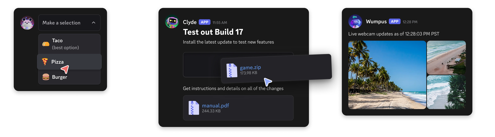

Components allow you to add interactive elements to modals and the messages your app sends. They're accessible, customizable, and easy to use.

Discord apps support three types of message components: layout components, content components, and interactive components. Each type of component has its own purpose and use cases.

*   Layout Components: These components are used to organize and structure the content of your message. They help create a visually appealing and user-friendly layout.
*   Content Components: These components are used to display information and content in your message. They can include text, images, and other media.
*   Interactive Components: These components allow users to interact with your message. They can include buttons, select menus, and other interactive elements.

All components are customizable and can be organized using layout components to create rich, interactive message experiences.

To use components, messages must be sent with the `IS_COMPONENTS_V2` flag (`1<<15`). Note that using this flag disables traditional content and embeds - all content must be sent as components instead.

[Legacy message component behavior](https://discord.com/developers/docs/components/reference#legacy-message-component-behavior) will not be deprecated and will continue to be available to your apps on a message-by-message basis. However, we recommend using the new components for new projects and features.

* * *

Do you have a question or want to connect with other app developers?

*   Join our [DDevs Discord Server](https://discord.gg/discord-developers) and get help from the community, share best practices, and discover new ways to enhance your apps.