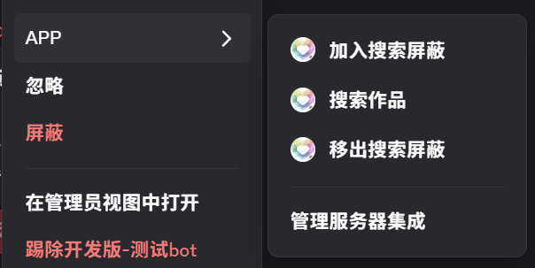
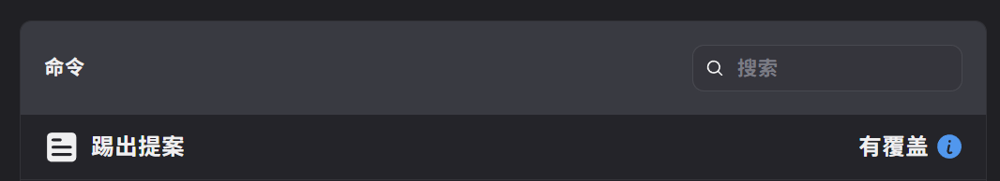
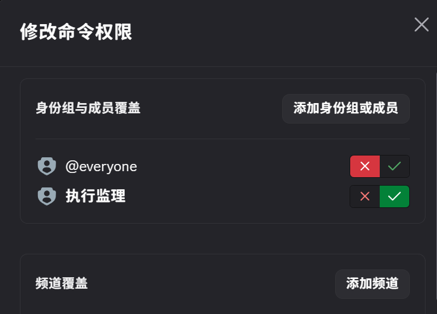

## 步骤 1：创建应用

首先，如果您还没有应用，需要在开发者门户中创建一个：

点击这里 ->  [创建应用](https://discord.com/developers/applications?new_application=true)

输入应用名称，然后点击“创建”。

创建应用后，您将进入应用设置的“通用信息”页面，可以在此更新应用的基本信息，例如描述和图标。您还会看到应用 ID 和交互端点 URL，这些将在指南后续部分使用。

### 获取凭据

我们需要设置并获取一些敏感信息，例如应用的令牌和 ID。

令牌用于授权 API 请求并承载应用的权限，因此极为敏感。请务必不要共享令牌或将其提交到任何版本控制系统。

??? note "示例项目配置，可无视"
    
    回到项目文件夹，将 `.env.sample` 文件重命名为 `.env`。我们将在此存储所有应用的凭据。

    您需要从应用设置中获取三个值并填入 `.env` 文件：

    *   在“通用信息”页面，复制应用 ID 的值。在 `.env` 文件中，将 `<YOUR_APP_ID>` 替换为您复制的 ID。
    *   返回“通用信息”页面，复制公钥的值（用于验证 HTTP 请求是否来自 Discord）。在 `.env` 文件中，将 `<YOUR_PUBLIC_KEY>` 替换为您复制的值。
    *   在“机器人”页面的“令牌”部分，点击“重置令牌”以生成新的机器人令牌。在 `.env` 文件中，将 `<YOUR_BOT_TOKEN>` 替换为您的新令牌。

除非重新生成，否则您将无法再次查看令牌，因此请务必将其保存在安全的地方（例如密码管理器）。

现在您已获得所需凭据，接下来让我们配置机器人用户和安装设置。

### 配置机器人

新创建的应用默认启用了"机器人用户"。它使您的应用在安装到服务器时，能够像其他服务器成员一样出现和运作。

在应用设置的左侧边栏中，有一个“机器人”页面（我们之前在此获取了令牌）。在此页面，您还可以配置诸如[特权意图](https://discord.com/developers/docs/events/gateway#privileged-intents)或是否允许其他用户安装等设置。

!!! Info "什么是 '意图 (intent) ' ?"

    意图 (intent) 决定了当你的应用创建网关 API 连接时，Discord 将向其发送哪些事件。例如，如果你希望你的应用在用户给消息添加反应时执行某个操作，你可以传入 GUILD_MESSAGE_REACTIONS (1 << 10) 意图。  
    
    某些意图是特权意图，这意味着它们允许你的应用访问可能被视为敏感的数据（例如消息内容）。  
    
    特权意图可以在应用设置的“BOT”页面配置，但它们必须在你的应用通过验证之前获得批准。标准的非特权意图不需要任何额外的权限或配置。

关于意图的更多信息，以及可用意图的完整列表（及其相关联的事件）可在网关文档中找到。

目前我们无需在此进行额外配置，但根据您的应用使用场景，未来可能需要调整。现在让我们着手准备应用的安装设置。

### 选择安装上下文

接下来，我们将确定您的应用在 Discord 中的安装位置，这取决于您的应用所支持的安装上下文

!!! Info "什么是 '安装上下文' ?"

    安装上下文决定了您的应用可以安装在哪里：安装至服务器、安装至用户，或两者兼可。 
    
    安装在服务器环境中的应用必须由拥有 MANAGE_GUILD (管理服务器) 权限的服务器成员授权，并对服务器的所有成员可见。  
    
    安装在用户环境中的应用仅对授权用户可见，因此不需要任何服务器特定的权限。它在用户的所有服务器、私信（DMs）和群组私信（GDMs）中都可见 —— 但是，它们仅限于使用命令。

点击左侧边栏中的“安装”选项，然后在“安装上下文”部分确保同时勾选“用户安装”和“服务器安装”。

某些应用可能仅支持一种安装上下文 —— 例如，审核类应用可能仅适用于服务器环境。但官方建议，你的应用应在默认情况下同时支持两种安装上下文。

如需了解更多关于用户可安装应用的详细信息，请参阅 [用户可安装应用教程 (官方)](https://discord.com/developers/docs/tutorials/developing-a-user-installable-app)

### 设置安装链接

Discord 提供的默认配置已经足够覆盖绝大多数的使用场景，故本节默认隐藏

??? Note "'安装链接' 的详情"

    安装链接为用户提供了在 Discord 中安装应用的便捷方式。
    
    如果您已配置安装链接，则应用的个人资料和应用目录页面中将出现“添加应用”按钮，引导用户完成应用的安装流程。
    
    我们将配置默认的 [Discord 提供链接](https://discord.com/developers/docs/resources/application#discord-provided-link)，但您也可以在 [应用文档](https://discord.com/developers/docs/resources/application#types-of-install-links) 中了解更多不同类型的安装链接。

    在安装页面中，进入“安装链接”部分，如果尚未选中，请选择“Discord 提供链接”。

    选择 Discord 提供链接后，将出现一个新的“默认安装设置”部分，接下来我们将对其进行配置。

### 添加作用域和机器人权限

应用需要获得安装用户的授权才能在 Discord 中执行操作（例如创建斜杠命令或获取服务器成员列表）。在安装应用之前，让我们先添加作用域和权限。

!!! Info "什么是作用域和权限？"

    创建应用程序时，作用域和权限决定了你的应用程序在 Discord 中能够执行的操作和能够访问的内容。  

    OAuth2 作用域 (SCOPES) 决定了您的应用在 Discord 中可以执行的操作和访问的内容。这是由安装应用到服务器的用户授予的。  

    权限 (Bot Permissions) 是针对你的机器人的细粒度权限，与 Discord 中其他用户所拥有的权限相同。它们可以由安装用户批准，或稍后在服务器设置中或通过权限覆盖进行更新。这些权限仅适用于安装到服务器的应用，因为安装到用户上下文的应用程序只能响应命令。

在安装页面的“默认安装设置”部分：

*   对于用户安装，添加 `applications.commands` 权限范围。
*   对于服务器安装，添加 `applications.commands` 权限范围和 `bot` 权限范围。选择 `bot` 后，将出现一个新的“权限”菜单，用于选择机器人用户的权限。选择您的应用可能需要的任何权限——目前，我仅选择 `发送消息` 权限。

查看所有 [OAuth2 作用域](https://discord.com/developers/docs/topics/oauth2#shared-resources-oauth2-scopes) 列表，或在文档中了解更多关于 [权限](https://discord.com/developers/docs/topics/permissions) 的信息。

### 安装您的应用

开发应用时，建议您在自己的用户账户（针对用户可安装应用）以及他人未活跃使用的服务器（针对服务器可安装应用）上进行构建和测试。如果您还没有自己的服务器，可以[免费创建一个](https://support.discord.com/hc/en-us/articles/204849977-How-do-I-create-a-server-)。

添加作用域后，复制之前“安装链接”部分的 URL。

由于我们的应用支持两种安装上下文，我们将把新应用安装到测试服务器和您的用户账户，以便在两种[安装上下文](https://discord.com/developers/docs/resources/application#installation-context)中进行测试。

#### 安装到服务器

要将应用安装到测试服务器，请从安装页面复制应用的默认安装链接。将链接粘贴到浏览器中并按回车键，然后在安装提示中选择“添加到服务器”。

选择您的测试服务器，并按照安装提示操作。应用成功添加到测试服务器后，您应该能在成员列表中看到它。

#### 安装到用户账户

接下来，将应用安装到您的用户账户。在浏览器中粘贴相同的安装链接并按回车键。这次，在安装提示中选择“添加到我的应用”。

按照安装提示将应用安装到您的用户账户。安装完成后，您可以与其开启私信对话。

### 创建一个零权限要求的邀请链接

为什么要通过零权限要求的邀请链接部署应用到服务器中？

嗯，总所周知，discord 服务器身份组数量上限仅有 250 个。在大型服务器中有点不太够用。

而通过有权限要求的邀请链接部署 BOT 到服务器中，会导致该 BOT 占据一个特殊的身份组。当 BOT 数量增多时，它们就会占用一部分的身份组数量。

那么，有没有办法解决这个问题呢？

答案是，通过零权限要求的邀请链接部署 BOT，这就不会占据身份组了。然后在服务器中通过身份组拼凑权限，或者设置 BOT 用户的特殊权限

这样，即可确保 bot 正常运行并不占用额外身份组

原理就在上面那个文档里

当然，如果你忘记了，也可以点击这里的 [回顾链接](../discordDocs/Chinese/Building%20your%20first%20Discord%20app_ch.md#add-scopes-permissions) 进行回顾

具体实现方法如下：

1.设置 Scope

如上，在 OAuth2 界面邀请链接生成器的 Scope 部分，必须勾选 applications.commands 和 bot，否则 bot 无法运行

至于 Scope 部分其他选项，勾不勾看你的bot有没有特殊需求。正常来说上面两个就够了。

2.设置权限

这里，一个都不要勾选。

3.生成邀请链接

选择服务器安装，然后复制下方的邀请链接

这就是我们需要的零权限要求的邀请链接

### 修改指令的可见性

有时候，我们需要实现这样的功能 : 让某些指令只能被某个/某些身份组使用

这个功能实现起来其实很简单, 可以分成以下两部分

#### 1. BOT 本身的校验

用户与 BOT 进行交互时，BOT 能获取当前交互用户的身份信息

所以，可以在响应逻辑的开头，检查交互用户是否拥有目的身份组 ID，如果没有，则直接返回错误提示，例如 "抱歉，您没有权利使用该命令" 之类的。不进行进一步的处理

这样，就确保了只有目标身份组能使用命令。

#### 2. 服务器权限的配置

通过服务器的配置，我们能让命令只能被拥有指定身份组的用户看见

这是通过命令权限的覆盖实现的 

(以下流程为网页版 Discord 的配置方式，其他平台应该差不多，我就懒得截了)

右键点击 BOT 头像，选择 APP -> 管理服务器集成

选中想要修改可见性的命令，点击

在身份组与成员覆盖中，添加 @everyone ，点 × 禁止

这样，"所有人都能看见该命令" 的默认配置就被覆盖了。现在这个命令除了管理员谁都看不到

然后，添加你想要允许看见的身份组，点 √ 允许

好了，现在这个命令就只有这个身份组能看见了

下方的频道覆盖也是同理，按类似的方式，就能让命令仅在指定频道可见