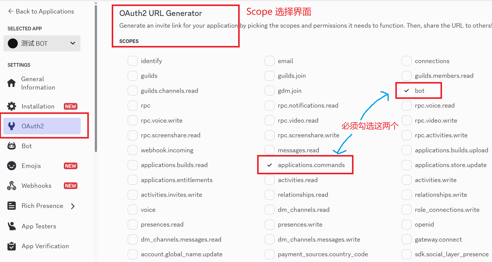
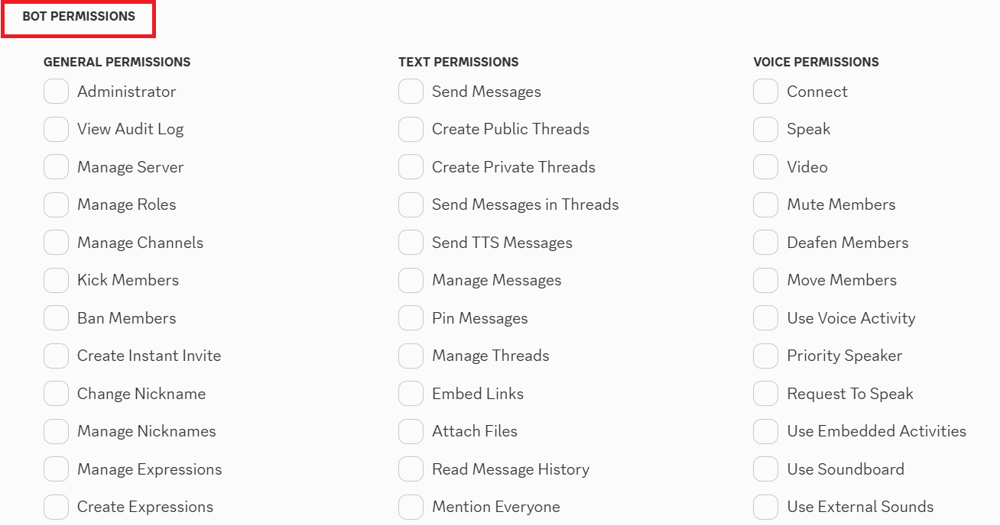
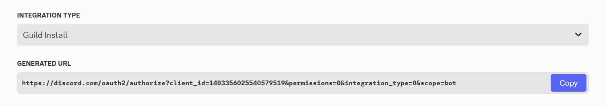

#### 关于 BOT 的作用域、权限配置

没写完，先看 [这里](../discordDocs/Chinese/Building%20your%20first%20Discord%20app_ch.md#set-bot)

#### 创建一个零权限要求的邀请链接

为什么要通过零权限要求的邀请链接部署应用到服务器中？

嗯，总所周知，discord 服务器身份组数量上限仅有 250 个。在大型服务器中有点不太够用。

而通过有权限要求的邀请链接部署 BOT 到服务器中，会导致该 BOT 占据一个特殊的身份组。当 BOT 数量增多时，它们就会占用一部分的身份组数量。

那么，有没有办法解决这个问题呢？

答案是，通过零权限要求的邀请链接部署 BOT，这就不会占据身份组了。然后在服务器中通过身份组拼凑权限，或者设置 BOT 用户的特殊权限

这样，即可确保 bot 正常运行并不占用额外身份组

原理请查看 [这里](../discordDocs/Chinese/Building%20your%20first%20Discord%20app_ch.md#add-scopes-permissions)

具体实现方法如下：

1.设置 Scope

如上，在 OAuth2 界面邀请链接生成器的 Scope 部分，必须勾选 applications.commands 和 bot，否则 bot 无法运行

至于 Scope 部分其他选项，勾不勾看你的bot有没有特殊需求。正常来说上面两个就够了。不过多勾选几个也无所谓，不会占用身份组

2.设置权限

这里，一个都不要勾选。

3.生成邀请链接

选择服务器安装，然后复制下方的邀请链接

这就是我们需要的零权限要求的邀请链接

